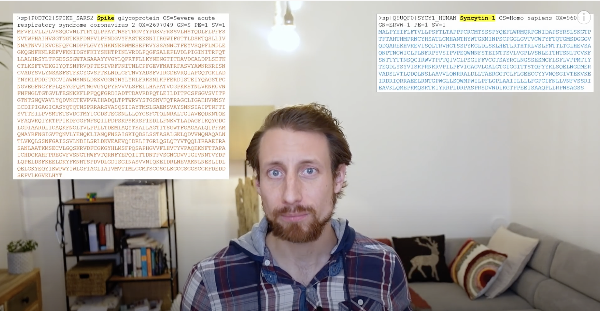
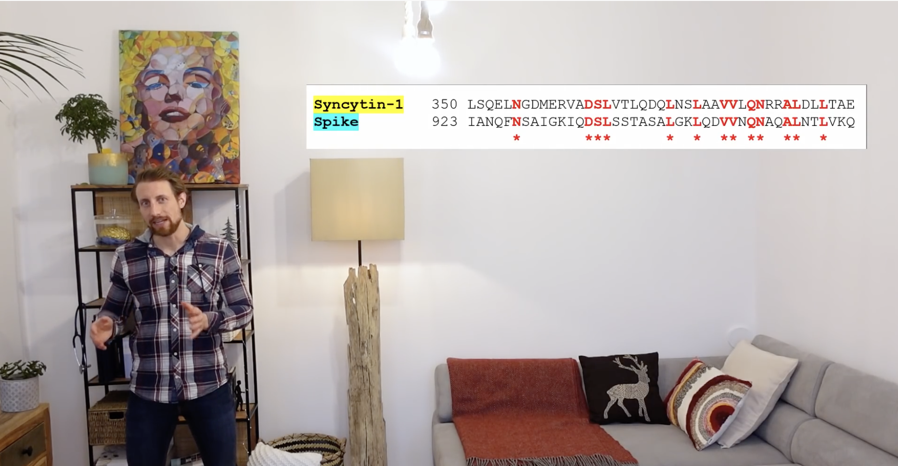

# Bioinformatik Syncytin-1

Idee aus dem Video von Martin Moder: [Die Impfung und die Fruchtbarkeit](https://youtu.be/cIf80tIIlBc)

Proteine sind Sequenzen aus den 20 [Aminosäuren](https://de.wikipedia.org/wiki/Aminosäuren#Kanonische_Aminosäuren), jede davon ist mit einem einzelnen Buchstaben dargestellt (A=Alanin, R=Arginin, ..., V=Valin). Also aus unserer Sicht nichts anderes als ein String.

Im Video wird der Behauptung nachgegangen die COVID-19 Impfung mache unfruchtbar. Diese Behauptung wird begründet durch die Ähnlichkeit des **SARS-CoV-2 Spike** Proteins (das durch die Impfung in den Körper kommt) mit **Syncytin-1** das bei der Bildung der Plazenta eine wichtige Rolle spielt. Spoiler: Ähnlichkeit stimmt nicht!



Am stärksten sollen sich die Proteine laut Video an dieser Stelle ähneln.



Und das ist ziemlich wenig Ähnlichkeit – laut Video. D.h. niemand wird unfruchtbar von der Impfung.

Schreibe ein Programm das diese Aussage prüft.


## COVID-19 Spike Protein

```
MFVFLVLLPLVSSQCVNLTTRTQLPPAYTNSFTRGVYYPDKVFRSSVLHSTQDLFLPFFSNVTWFHAIHVSGTNGTKRFDNPVLPFNDGVYFASTEKSNIIRGWIFGTTLDSKTQSLLIVNNATNVVIKVCEFQFCNDPFLGVYYHKNNKSWMESEFRVYSSANNCTFEYVSQPFLMDLEGKQGNFKNLREFVFKNIDGYFKIYSKHTPINLVRDLPQGFSALEPLVDLPIGINITRFQTLLALHRSYLTPGDSSSGWTAGAAAYYVGYLQPRTFLLKYNENGTITDAVDCALDPLSETKCTLKSFTVEKGIYQTSNFRVQPTESIVRFPNITNLCPFGEVFNATRFASVYAWNRKRISNCVADYSVLYNSASFSTFKCYGVSPTKLNDLCFTNVYADSFVIRGDEVRQIAPGQTGKIADYNYKLPDDFTGCVIAWNSNNLDSKVGGNYNYLYRLFRKSNLKPFERDISTEIYQAGSTPCNGVEGFNCYFPLQSYGFQPTNGVGYQPYRVVVLSFELLHAPATVCGPKKSTNLVKNKCVNFNFNGLTGTGVLTESNKKFLPFQQFGRDIADTTDAVRDPQTLEILDITPCSFGGVSVITPGTNTSNQVAVLYQDVNCTEVPVAIHADQLTPTWRVYSTGSNVFQTRAGCLIGAEHVNNSYECDIPIGAGICASYQTQTNSPRRARSVASQSIIAYTMSLGAENSVAYSNNSIAIPTNFTISVTTEILPVSMTKTSVDCTMYICGDSTECSNLLLQYGSFCTQLNRALTGIAVEQDKNTQEVFAQVKQIYKTPPIKDFGGFNFSQILPDPSKPSKRSFIEDLLFNKVTLADAGFIKQYGDCLGDIAARDLICAQKFNGLTVLPPLLTDEMIAQYTSALLAGTITSGWTFGAGAALQIPFAMQMAYRFNGIGVTQNVLYENQKLIANQFNSAIGKIQDSLSSTASALGKLQDVVNQNAQALNTLVKQLSSNFGAISSVLNDILSRLDKVEAEVQIDRLITGRLQSLQTYVTQQLIRAAEIRASANLAATKMSECVLGQSKRVDFCGKGYHLMSFPQSAPHGVVFLHVTYVPAQEKNFTTAPAICHDGKAHFPREGVFVSNGTHWFVTQRNFYEPQIITTDNTFVSGNCDVVIGIVNNTVYDPLQPELDSFKEELDKYFKNHTSPDVDLGDISGINASVVNIQKEIDRLNEVAKNLNESLIDLQELGKYEQYIKWPWYIWLGFIAGLIAIVMVTIMLCCMTSCCSCLKGCCSCGSCCKFDEDDSEPVLKGVKLHYT
```

[Quelle](https://www.ebi.ac.uk/interpro/protein/UniProt/P0DTC2/sequence/#1-1273)

Wer sich das Spike Protein gerne [anschauen](https://swissmodel.expasy.org/repository/uniprot/P0DTC2) möchte 😉.

## Syncytin-1 (ERVW-1)

> Syncytin-1 wird durch das Gen ERVWE1 auf Chromosom 7 (Genlokus 7q21.2) kodiert. Das Gen stammt vermutlich von einem Retrovirus, das im Laufe der Phylogenese vor ca. 25 Millionen Jahren in das menschliche Genom integriert wurde. Syncytin-1 stellt als Retroelement das ursprüngliche Hüllprotein eines humanen endogenen Retrovirus (HERV) aus der Gruppe W dar (HERVW-1). [Quelle](https://flexikon.doccheck.com/de/Syncytin-1)

```
MALPYHIFLFTVLLPSFTLTAPPPCRCMTSSSPYQEFLWRMQRPGNIDAPSYRSLSKGTPTFTAHTHMPRNCYHSATLCMHANTHYWTGKMINPSCPGGLGVTVCWTYFTQTGMSDGGGVQDQAREKHVKEVISQLTRVHGTSSPYKGLDLSKLHETLRTHTRLVSLFNTTLTGLHEVSAQNPTNCWICLPLNFRPYVSIPVPEQWNNFSTEINTTSVLVGPLVSNLEITHTSNLTCVKFSNTTYTTNSQCIRWVTPPTQIVCLPSGIFFVCGTSAYRCLNGSSESMCFLSFLVPPMTIYTEQDLYSYVISKPRNKRVPILPFVIGAGVLGALGTGIGGITTSTQFYYKLSQELNGDMERVADSLVTLQDQLNSLAAVVLQNRRALDLLTAERGGTCLFLGEECCYYVNQSGIVTEKVKEIRDRIQRRAEELRNTGPWGLLSQWMPWILPFLGPLAAIILLLLFGPCIFNLLVNFVSSRIEAVKLQMEPKMQSKTKIYRRPLDRPASPRSDVNDIKGTPPEEISAAQPLLRPNSAGSS
```

[Quelle](https://www.uniprot.org/uniprot/Q9UQF0.txt)