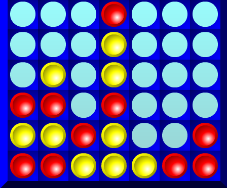

Das klassische Brettspiel wird auf einem senkrecht stehenden hohlen Spielbrett gespielt, in das die Spieler abwechselnd ihre Spielsteine fallen lassen. Das Spielbrett besteht aus **sieben** Spalten (senkrecht) und **sechs** Reihen (waagerecht). 





Jeder Spieler besitzt 21 gleichfarbige Spielsteine. Wenn ein Spieler einen Spielstein in eine Spalte fallen lässt, besetzt dieser den untersten freien Platz der Spalte. Gewinner ist der Spieler, der es als erster schafft, vier oder mehr seiner Spielsteine waagerecht, senkrecht oder diagonal in eine Linie zu bringen. Das Spiel endet unentschieden, wenn das Spielbrett komplett gefüllt ist, ohne dass ein Spieler eine Viererlinie gebildet hat.

---

#### Übung (Vier Gewinnt Grundlage)

Ein erstes Programmgrundgerüst:

- Lege für das Spielfeld ein zweidimensionales `int` Array  an (6 Zeilen, 7 Spalten).
  Die Array Elemente können 3 Zustände annehmen: 

  - 0 – Spielfeld ist leer, 
  - 1 --- Stein von Spieler 1, 
  - 2 --- Stein von Spieler 2.

- Schreibe eine Funktion `void spielfeld(int a[][7])` die das Spielfeld ausgibt. Beispiel:

  ```
  +---------------+
  |       *       |
  |       o       |
  |   o   o       |
  | * *   *       |
  | o o * o     * |
  | * * o o o * * |
  +---------------+
    1 2 3 4 5 6 7
  ```

- Schreibe eine Hilfs-Funktion für das Einwerfen eines Spielsteins `int findeZeile(int a[][7],int s)` die für eine gegebene Spalte `s` die unterste freie Zeile ermittelt.
- Erweitere das Programm so, dass 2 Spieler abwechselnd einwerfen können.
  Spieler 1 beginnt. Verwende die Funktion `findeZeile` und gib das Spielfeld nach jedem Spielzug neu aus.
- Verhindere das Einwerfen in einer bereits vollen Spalte.
- Das Programm soll beendet werden wenn alle Spalten voll sind.


---

#### Übung (Siegerkennung)

Das Spiel soll erkennen können ob ein Spieler gewonnen hat. 

- Schreibe eine Funktion `testZeile`
  die Funktion soll ermitteln, wenn ein Spieler an einer Position (gegeben durch Zeile und Spalte) einwerfen würde, wie viele Steine der eigenen Farbe sich in einer Reihe in der Zeile ergeben würden.
  Rückgabwert: Die Anzahl der Steine in Reihe.
  Parameter: Spielfeld, Zeile, Spalte, Spielernummer.

Schreibe nach dem gleichen Schema:

- `testSpalte`, `testHauptDiagonale`, `testNebenDiagonale`

- Schreibe nun, mit Hilfe dieser Funktionen, eine weitere Funktion die erkennt ob ein Spieler gewonnen hat: `bool testSieg(...)`
- Das Programm soll mit Hilfe der Funktion `testSieg` einen Text ausgeben falls ein Spieler gewonnen hat und sich dann beenden.


---

#### Übung (Künstliche Intelligenz)

Das Spiel soll nun gegen den Computer gespielt werden. Spieler 2 ist der Computergegner. 
Schreibe für die Ermittlung des Computerzugs eine eigene Funktion `int computerZug(int a[][7],int spieler,int strategie)`, dabei gibt der Parameter `spieler` an für welchen Spieler der Zug generiert werden soll, der Parameter `strategie` nach welcher Methode der Zug ermittelt wird und Rückgabewert ist die Spalte für den Einwurf.

Implementiere folgende Strategien (steigender Schwierigkeitsgrad):

- 
Die Spalte in der der Computer einwirft wird zufällig gewählt.
- 
Es wird in die Spalte eingeworfen die am wenigsten Steine hat.
- 
Bevorzuge Spalten in der der eingeworfene Stein möglichst viele gleichfarbige Nachbarn hat. 
- 
Nimm die Spalte in der sich die längste Reihe (horizontal, vertikal oder diagonal) an gleichfarbigen Steinen ergibt. 
- Prüfe ob der Gegner im nächsten Zug gewinnen könnte und verhindere das.


---

#### Übung (Erweiterungen)

Möglichkeiten:

- Du kannst am Anfang auswählen ob Spieler 1 oder Spieler 2 der Computergegner ist.
- Versuche die Spielstärke des Computergegners zu erhöhen.


