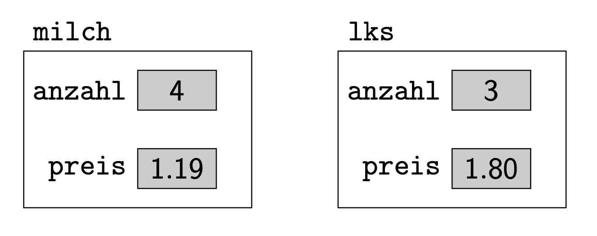
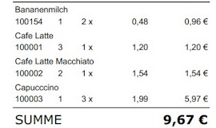
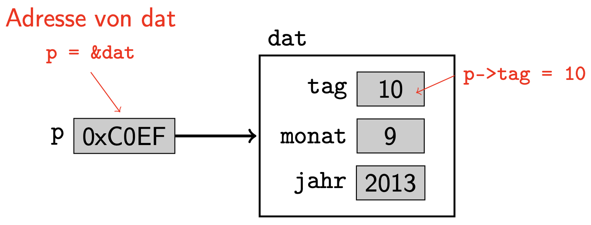

<script src="https://cdn.mathjax.org/mathjax/latest/MathJax.js?config=TeX-AMS-MML_HTMLorMML" type="text/javascript"></script>

# Strukturen

Eine Struktur ist eine Zusammenfassung mehrerer Variablen.

**Beispiel:**
Menge und Einzelpreis einer gekauften Ware.

```c
struct Einkauf {
    int anzahl; // menge
    double preis; // Einzelpreis
};
```


```c
int main()
{
    Einkauf milch;

    milch.anzahl = 4;
    milch.preis = 1.19;
    
    double gesamt;
    gesamt = milch.anzahl * milch.preis;
}
```

- `struct`: Neuer **Datentyp** (noch kein Speicher!). Dies ist eine Beschreibung wie die Struktur aussieht.
- Davon werden **Variablen** angelegt (Speicher!).
- Diese Struktur-Variablen bestehen aus weiteren Variablen (**Komponenten**).


Durch das Anlegen einer Strukturvariable werden gleichzeitig alle in dieser enthaltenen (Komponenten-) Variablen angelegt.


## Speicher
**Beispiel:** Eingekauft werden 4 Packungen Milch zu je 1,19 und 3 Leberkässemmeln zu je 1,80.
```c
Einkauf milch;
Einkauf lks;

milch.anzahl = 4;
milch.preis = 1.19;

lks.anzahl = 3;
lks.preis = 1.80;
```

Wie dies im Speicher aussieht kann man sich so vorstellen:




---

**Übung (Ein- und Ausgabe):**
Schreibe ein Programm mit dem 2 Einkäufe eingegeben werden können.
Das Programm soll beide Einkäufe ausgeben (Anzahl und Preis) sowie den Gesamtpreis ausrechnen und ausgeben.

---

**Übung (Warenbezeichnung):**
Erweitere so, dass auch die Bezeichnung der Ware berücksichtigt wird.

---


## Arrays von Strukturvariablen

```c
Einkauf korb[3];
```
```c
korb[0].anzahl = 1;
korb[0].preis = 3.99;
...
korb[2].preis = 2.79;
```


---
**Übung (Einkaufskorb):**
Schreibe ein Programm zur Verwaltung eines Einkaufkorbs. Der Korb enthält genau 7 Waren. Schreibe eine Eingabe für alle 7 Waren

Am Ende des Programms soll der gesamte Inhalte des Einkaufkorbs in übersichtlicher Weise dargestellt werden. Denke dabei an einen Kassenbon:




---

**Übung (Einkaufskorb II):**
Ergänze:

- Man soll auch weniger als 7 Stück in den Einkaufskorb legen können.

- 
Ermittle die teuerste Ware (Anzahl * Preis).
- Ergänze eine Strukturvariable (`int`) für die Warengruppe. Es gibt folgende Gruppen:
	
	- 1 – Obst
	- 2 – Getränke
	- 3 – Nahrungsmittel
	- 4 – Süßwaren
	
	Berücksichtige die Warengruppe bei der Ein- und Ausgabe. 
	
- Gib am Ende die Preis-Summe pro Warengruppe aus.

---


## Strukturen und Zeiger

Es können Zeiger auf Strukturvariablen definiert werden.

```c
struct Datum {
    int tag;
    int monat;
    int jahr;
};
```


```c
Datum dat = {22,9,2013};

Datum* p;
p = &dat;

p->tag = 10;
```

"Pfeilschreibweise" bei **Zeiger auf** Strukturen – Sonst müsste `(*p).tag` geschrieben werden, weil `.` eine höhere Priorität als `*` hat.

Im Speicher kann man sich das folgendermaßen vorstellen:


```c
Datum dat = {22,9,2013};
Datum* p;
p = &dat;
p->tag = 10;
```




### Anwendung – Zeiger
Für die Parameterübergaben an Funktionen.

- Bei der Parameterübergabe an Funktionen wird kopiert (call-by-value).
- Strukturen sind meist etwas umfangreicher.
- Kopieren braucht Zeit.
- Ein Zeiger alleine ist schneller kopiert als die ganze Struktur.


**Beispiel:**

```c
struct Datum
{
    int tag;
    int monat;
    int jahr;
};
```


```c
void heute(Datum* d)
{
    d->tag = 11;
    d->monat = 11;
    d->jahr = 2011;
}
```


```c
main()
{
    Datum h;
    heute(&h);
}
```


---

**Übung (Ein- und Ausgabe):**
Beginne ein neues Projekt und schreibe für die Struktur `Einkauf` eine Funktion zur Eingabe und eine Funktion zur Ausgabe.
Diesen Funktionen wird ein Zeiger auf `Einkauf` als Parameter übergeben.
Aufruf:

```c
Einkauf joghurt;
input(&joghurt);
output(&joghurt);
```


---

**Übung (Erweiterung Einkaufskorb):**
Verwende die Funktionen `input` und `output` im Programm der Einkaufskorb-Übung.


---

**Übung (Datum vergleichen):**
Schreibe eine Funktion die 2 als Zeiger übergebene Datums-Strukturen vergleicht.
Ist das erste Datum früher soll die Funktion 1, bei Gleichheit 0 und falls das erste Datum später als das zweite ist $$-1$$ zurückgeben.

---


 
