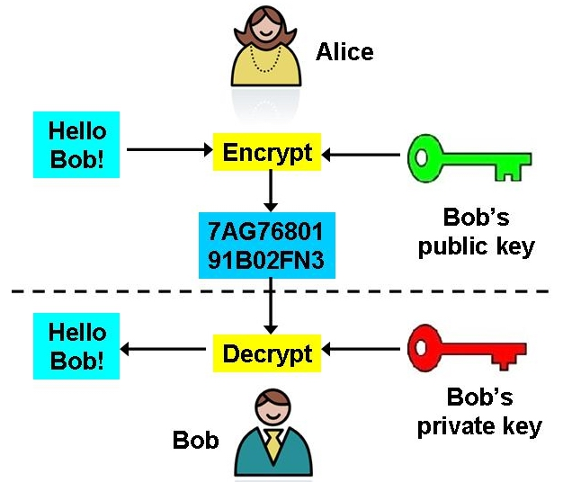

Bei symetrischer Verschlüsselung muss ein Schlüssel ausgetauscht werden. Dieser Schlüsselaustausch ist angreifbar.

**Public-key cryptography** ist eine innovative Idee aus den 1970er Jahren die einen solchen Angriff unmöglich macht. 

Dabei gibt es 2 Schlüssel:

- einen geheimen **private key** der nicht weitergegeben wird und
- einen öffentlichen **public key** der ohne Einschränkung verbreitet werden kann.

Die Schlüssel sind sehr groß, z.B. 4096 bits.

Anwendung:

- *encryption* (sehr rechenaufwändig, Daten<Schlüssellänge)
- *authentication*
- *symmetric key* transport (*key exchange*)
- *digital signature (in Verbindung mit Hash Funktion)*

# Ablauf 

Alice will an Bob eine verschlüsselte Nachricht schicken.

- Bob berechnet (aus großen Primzahlen) 2 Schlüssel (**public key** und **private key**). Der public key wird öffentlich zugänglich gemacht der private key geheim gehalten.
- Alice holt sich **Bobs public key**, **verschlüsselt** die Nachricht damit und schickt sie an Bob.
- Bob verwendet seinen **private key** um die Nachricht zu **entschlüsseln**.
- **Eve** die die Nachricht abhört kann die Nachricht ohne den private key nicht entschlüsseln. Eve hat Zugang zum public key, aber mit diesem kann nicht entschlüsselt werden.
- Für Kommunikation in **umgekehrter Richtung** (Bob an Alice) muss Alice ein eigenes public/private Schlüsselpaar erzeugen.

