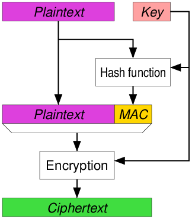

# Motivation

Angriffe auf Verschlüsselungssysteme können passiv oder aktiv sein.

- **passive attack –**  mitlesen von Daten und der Versuch diese zu entschlüsseln.
- **active attack –**  Angreifer hat die Möglichkeit Daten im Kommunikationskanal zu verändern, ganz zu löschen, bzw. vorher aufgezeichnete Daten erneut zu senden (reply attack).

Stream oder Block cipher bieten zwar confidentiality (d.h. Schutz gegen passive attacks) aber keinen Schutz gegen active attacks.

Message Authentication Codes (**MAC**s) sind eine Möglichkeit active attacks zu erkennen.

Grundlage dafür sind **kryptografisch sichere Hash Funktionen**.

# Hash Funktionen

Ist eine Funktion $h(m)$ die aus einem beliebig langen Input m einen Output fester Länge (z.B. 128, 256 Bits) erzeugt.

h ist **collision resistant**, 
bedeutet es ist nicht möglich $m_1\neq m_2$ zu finden die eine Kollision $h(m_1)=h(m_2)$ verursachen (obwohl diese existieren).

Es sind nur wenige kryptografisch sichere Hash Funktionen bekannt, aktuelle Standards:
[SHA - wikipedia](https://en.wikipedia.org/wiki/Secure_Hash_Algorithms)

Für keine SHA-2 oder SHA-3 Variante wurde bisher eine Kollision gefunden. 
Für SHA-1 schon (daher deprecated für signieren von Zertifikaten)!

# Message integrity

Durch anhängen eines Hash Werts an die Nachricht kann deren Integrität geprüft werden.
Allerdings kann ein Angreifen den Hash-Wert auch selber berechnen.
Es ist daher notwendig den Hash Wert durch einen shared secret key zu verschlüsseln.

Verschlüsseltes Hashing = MAC (*message authentification code*)

- Sender: MAC **signing**
- Empfänger: MAC **verification**

MAC bietet *integrity* und *authentication*: 

- **integrity**: Änderung der Daten wird erkannt, da der MAC Wert nicht mehr stimmt.
- **authentication**: MAC stimmt nur, wenn der Absender den MAC-Schlüssel besitzt.

Konstruktion des MAC - 2 Möglichkeiten:

- Aus einer Hash Funktion,  Beispiel: [HMAC](https://de.wikipedia.org/wiki/Keyed-Hash_Message_Authentication_Code). Häufig, z.B. HMAC/SHA-256 in https. Hinweis: HMAC-SHA1 ist sicher, obwohl SHA1 eine bekannte Schwäche hat.
- Aus einer block cipher: [CBC-MAC](https://en.wikipedia.org/wiki/CBC-MAC), Anwendung: WLAN/802.11i (WPA2)

# Authenticated Encryption (AE)

**secure channel** = confidentiality + integrity + authentication

Implementiert durch einen MAC und eine Verschlüsselungsmethode.
Mehrere Möglichkeiten der Kombination – z.B. [MAC-than-encrypt](https://en.wikipedia.org/wiki/Authenticated_encryption#MAC-then-Encrypt_.28MtE.29):

Ablauf Secure Channel **Protocol**:

- **key negotiation**, session key wird ausgehandelt, 
  - bei jedem Verbindungsaufbau **neuer key**
  - Unterschiedliche keys für encryption, MAC und IV (falls benötigt)
  - Unterschiedliche keys pro Kommunikationsrichtung (d.h. mind 4 oder 6 keys). 
- Zähler im Protokoll um einen replay attack zu verhindern
- Datenaustausch mit encrypt + MAC

## Beispiel für AE

- https (TLS)
- 802.11i (WPA2): CCMP (Counter-Mode/CBC-MAC Protocol)

In manchen Protokolle wie TLS wird die Art der Verschlüsselung und Berechnung des MAC bei Verbindungsaufbau ausgehandelt. Die verwendete Kombination wird als **cipher suite** bezeichnet.

# GCM

Da Encryption und MAC Berechnung voneinander unabhängig sind entsteht ein doppelter Aufwand. Es gibt Verfahren die beides miteinander kombinieren, z.B. [GCM - Galois/Counter Mode](https://en.m.wikipedia.org/wiki/Galois/Counter_Mode), basiert auf einer block cipher (z.B. AES).

