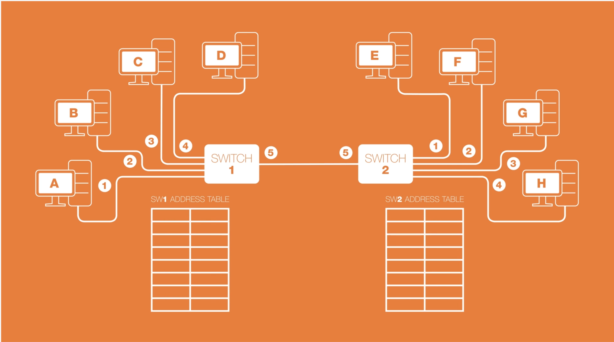
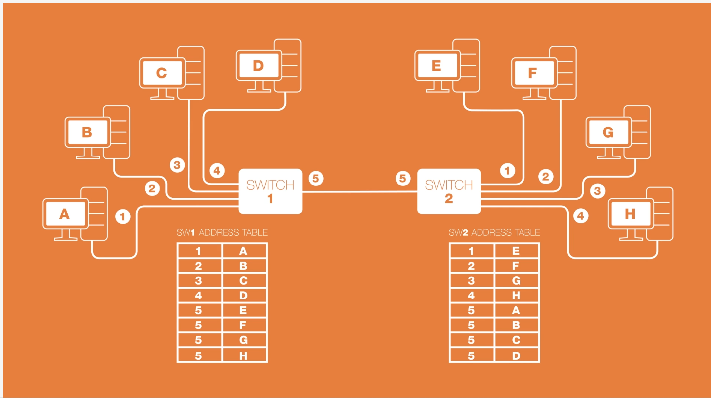

Netzwerk Switches verbinden Hosts untereinander. Ein Switch hat eine gewisse Anzahl von Ports (8,16,32,...) an denen Hosts (oder weitere Switches) angeschlossen werden. Die Verkabelung ist sternförmig zum Switch. Jeder  Host sendet Frames zum Switch und dieser leitet die Frames weiter. Für jeden Port merkt sich ein Switch die Source-MAC-Adressen der von dort empfangen Frames. Dies wird gespeichert in der **SAT** (source address table), oder auch genannt **CAM** (content addressable memory).

Beim weiterleiten eines Frames wird dessen Destination-MAC-Adresse in der SAT gesucht und falls gefunden nur auf dem gelernten Port gesendet. Wird die Addresse nicht in der SAT gefunden wird  der Frame auf allen Ports (außer dem Empfangsport) gesendet (flooding).

SAT hat ein Speicherlimit, wird dieses überschritten haben nicht mehr alle Adressen des Netzwerks Platz, und Frames werden auf allen Ports gefloodet.

**CAM Overflow Attack:** Angreifer schickt viele Frames mit unterschiedlichen source MAC adressen (die gar nicht existieren müssen). CAM wird voll und Switch beginnt mit flooding (weil DMAC im CAM nicht gefunden wird). Gesamter Datenverkehr wird im Netzwerk sichtbar.

Vorteil für den Angreifer: dieser kann nun den gesamten Traffic im Netz mitlesen (tracen).

## Beispiel

## Pentest

Tools: `macof` (in `dsniff` suite)

## Schutz vor CAM Overflow

**Port Security**: Switch feature

Maximale Anzahl von MAC Adressen pro Port wird im Switch konfiguriert – default: 1. Hinweis: Nur wenn ein anderer Switch am Port hängt muss es mehr als 1 sein. 

violation trigger bei Überschreiten der Anzahl. Reaktionen:

- SNMP message – Simple Network Management Protocol – an einen zentralen Logger
- Logging im Switch
- Konfigurierbar:
  - shutdown port, reenable durch Netzwerkadministrator oder nach Ablauf einer konfigurierten Zeit.
  - restrict port, alle Frames mit "violating" MAC Adressen werden verworfen

