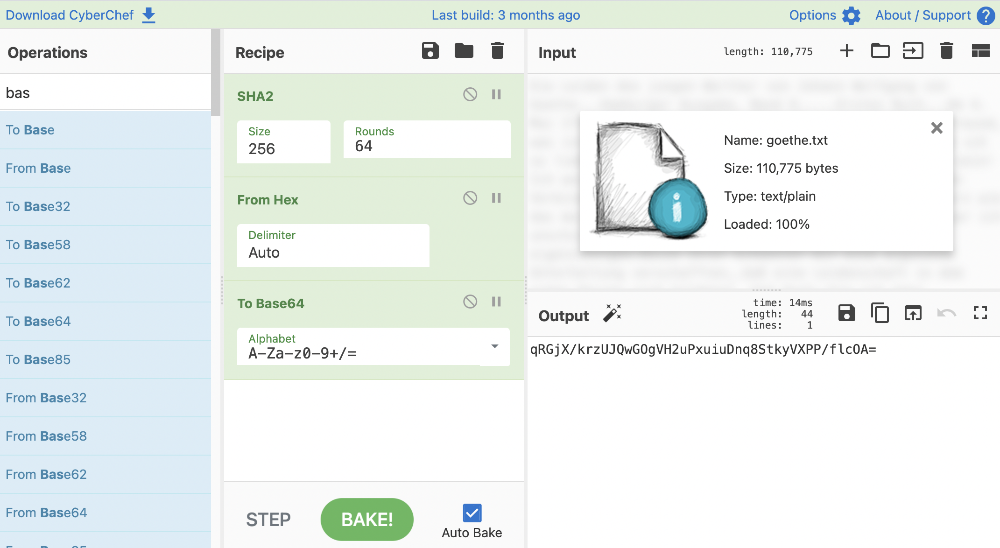

#### Übung (Base64 kodieren)

```
Hex: 4e62

0100 1110 0110 0010

0100 1110 0110 0010 00

010011 100110 001000
T      m      I

TMI=
Padding mit = da nur 2 (statt 3 Byte) kodiert wurden
```


---

#### Übung (SHA256 mit CyberChef)




---

#### Übung (SHA256 mit openssl)

```bash
$ wget https://matejkaf.github.io/Doc/Cybersecurity/11_hashing_und_encoding/goethe.txt

$ openssl dgst -sha256 goethe
$ openssl dgst -sha256 -binary goethe.md | openssl base64

# Hex mit xxd
$ openssl dgst -sha256 -binary goethe.md | xxd -p | tr -d '\n'

# Hex mit cut
$ openssl dgst -sha256 goethe.md | cut -d ' ' -f 2

# Base64
$ openssl dgst -sha256 -binary goethe.md | base64 

# Berechnungen mit word count (wc)
$ openssl dgst -sha256 -binary goethe.md | openssl base64 | wc -m
$ openssl dgst -sha256 goethe.md | cut -d ' ' -f 2 | wc -m
```


