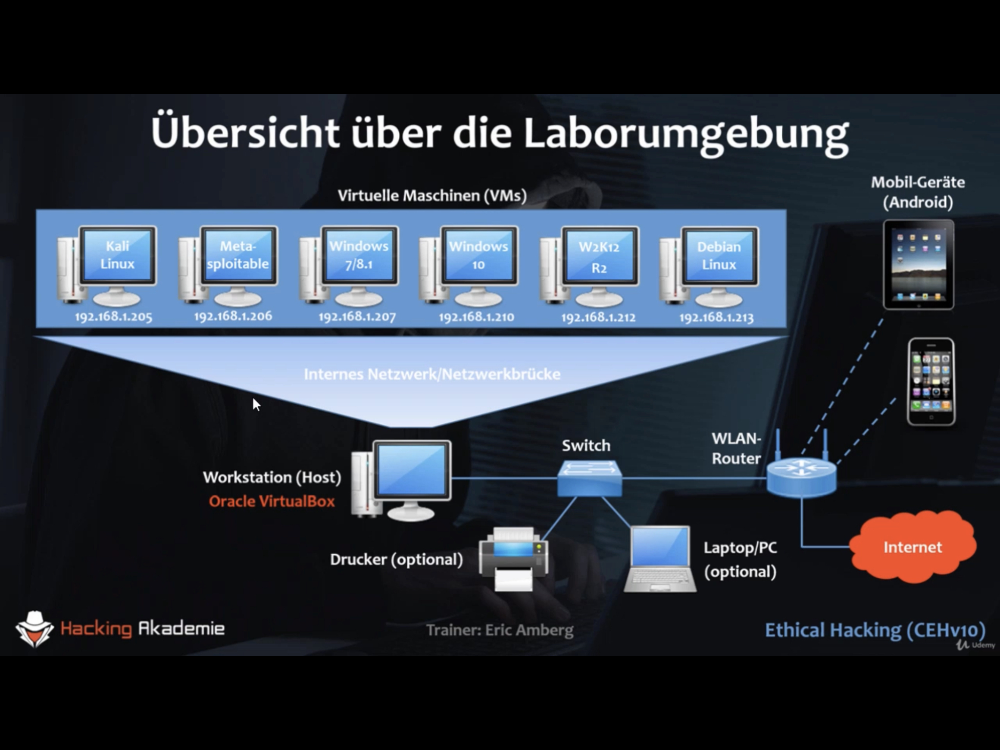

Ethical Hacking CEHv10 (Udemi-Kurs), Eric Amberg


# Laborumgebung

- Host mit VirtualBox
- Weitere VMs mit Internem Netzwerk
  - Netzwerkbrücke zur Verbindung mit realem Netzwerk
- KALI Linux
- Metasploitable (Virtueller Sandsack!)
- Windows Client mit älteren Varianten (7/8.1)
- Windows Server 2012: W2K12 R2 für Netzwerkumgebung, Active Directory, ...
- Debian Linux


# Installieren

- **Virtual Box**

- Download
  
  - Installieren
  
- **Kali Linux**
  - [](https://www.kali.org)
  
  - Kali Linux 64-bit VirtualBox, OVA Datei – Vorteil: ist vorkonfiguriert
  
  - ca. 4 GB!
  
  - These images have a default login/password of “kali/kali” and may have pre-generated SSH host keys.
  
  - `kali-linux-2020.4-vbox-amd64.ova`, In Virtual Box importieren, 1024 MB Arbeitsspeicher reichen (2048 voreingestellt). USB Controller und Sound Card deaktivieren, >Import<, ca. 2min, Legt eine Kopie der ova Datei an, die ova Datei kann man dann löschen.
  
  - Starten in vbox
  
  - Login: kali/kali
  
  - Darstellung kann sehr klein sein auf Retina Displays, >View>Virtual Screen 1>Scale to 200%
  
  - Verwenden einer deutschen Tastatur
  
    ```bash
    $ setxkbmap -layout de
    # bis zum nächsten Booten!
    ```
    
    Über GUI: auf Kali Symbol klicken. "Keyboard" eintippen, Layout ... Add ... German (Austria) ... English entfernen ... System Reboot
    
    
  
- **Metasploitable 2** installieren – auf Ubuntu basierend, mit vielen Sicherheitslücken

  - Download: https://sourceforge.net/projects/metasploitable/files/Metasploitable2/, ca. 900MB
  - zip File, Enthält einen Ordner mit einer vmware VM, diesen Ordner in den vbox Ordner verschieben
  - `Metasploitable.vmdk` ist die virtuelle Festplatte, diese ist in einer neuen vbox VM einzubinden
  - vbox

  - neue VM erstellen
  - Name: Metasploitable
  - Type: Linux
  - Version: Ubuntu 32 Bit
  - Continue
  - 512 MB ausreichend
  - Use an existing virtual hard drive file/Vorhandene Festplatte verwenden, Add, `Metasploitable.vmdk` auswählen
  - Starten der VM und anmelden mit msfadmin/msfadmin
  - Start in der Kommandozeile
  - `ifconfig` zeigt aktuelle IP Konfiguration, IP Adresse von eth0 interessant, IP Adresse passt nicht (kommt vom DHCP?)
  - `sudo shutdown -h now`, Hinweis: englische Tastatur eingestellt `-` ist bei `ß`
    - VirtualBox hat einen internen DHCP Server der aus 10.0.2.0/24 eine IP Adresse zuweist (wenn auf NAT gestellt), dadurch können die VMs nicht untereinander kommunizieren. VMs sollen Teilnehme im "echten" Netzwerk sein. Einstellen auf "Netzwerkbrücke"/"Bridged Adapter". (Bridge = ein in Software implementierter Switch)
    - Auch Kali Linux umstellen
    - Beide VMs nehmen nun am normalen Netzwerk teil
    - Starten von Kali Linux Fehler: `VERR_SUPDRV_COMPONENT_NOT_FOUND` (macOS), Reinstall von vbox hilft (Fehlermeldung beim ersten Installieren?)
    - Mit `ifconfig` in Kali und Metasploitable prüfen

- **Windows7**
  
  - gekauft am 08.12.2020
  - vbox, neue VM erstellen
  - 1024 GB Arbeitsspeicher
  - Festplatte erzeugen, VDI, dynamisch, 32GB
  - Einstellungen – Storage – DVD Laufwerk – choose a disk file...
  - Einstellungen - Netzwerk auf Bridged
  - VM starten
  - Benutzerdefiniert:  (virtuelle) Festplatte als Ziel auswählen
  - Benutzername: wintest, Computername: Win7, PW: wintest
  - Keinen Product-Key eingeben und nicht automatisch aktivieren
  - Nur wichtige Updates installieren
  - Arbeitsplatznetzwerk auswählen
  - Kommandozeile: ipconfig, IP Adresse erhalten, Test: andere VM anpingen (Kali), Windows scheint man nicht anpingen zu können
  - IP Einstellungen unter Windows 7 ändern:
    - In der Taskleiste rechts, Rechtsklick auf das Netzwerksymbol
    - Netzwerk- und Freigabecenter öffnen
    - Adaptereinstellungen ändern
    - Doppelklick auf Icon LAN-Verbindung
    - Button Eigenschaften
    - IPv4 auswählen, Button Eigenschaften
  
- Aktuelles Windows 10
  - Direkt herunterladen: [](https://www.microsoft.com/de-de/software-download/windows10ISO)
    - Oder: **Media Creation Tool**: Unter Windows installieren. Damit kann eine ISO Datei für das aktuell installierte Windows erstellt werden.
  - 1024 MB, 50 GB
  - Keinen Produkt-Key, Windows 10 Pro, 
  - Benutzerdefiniert, ...
  - Sprachassistent ausschalten, Offline Konto erstellen, Eingeschränkte Erfahrung
  - Benutzername: win10test/win10test
  - vbox Fenstergröße ändern hat keine Auswirkung auf das Windows Fenster, >Devices>Guest Additions ...
    - Aus dem Datei Explorer starten
    - Den gleichen Schritt kann man auch unter Windows7 machen
  
- Windows Server
  - Windows Server 2012R2
  - Google: "evaluate windows server 2012 r2", Läuft 180 Tage, 
  - ISO Format auswählen, Als Daten kann man irgendwas eingeben
  - 4,6 GB Download
  - vbox neue VM "W2K12R2", Windows 2012
  - 2048MB Empfehlenswert
  - ... Datacenter ... mit grafischer ...
  - Benutzerdefiniert ...
  - Administrator / Win2ktest (Kennwortkomplexität!)
  - Installieren:  >Devices>Guest Additions ...
  - Konfig: Server-Manager > Lokaler Server > Computername, "W2K12R2"
  - Konfig: Server-Manager > Lokaler Server > IPv4 Adresse, 192.168.1.212/24
  
- Debian Linux
  - www.debian. org, stable release, DVD / amd64
  
  - [](https://cdimage.debian.org/debian-cd/current/amd64/iso-dvd/)
  
  - Download `debian-10.7.0-amd64-DVD-1.iso`, 3,7GB
  
  - vbox neue VM, "Linux-Server", Debian (64-bit)
  
  - 1024MB
  
  - 20,0 GB Festplatte
  
  - Rechner Name "Linux-Server"
  
  - Domain-Name: "linux.local"
  
  - Root password: "toor"
  
  - Name/Benutzername/pw: **Eric/eric/debiantest**
  
  - Partitionierungsmethode: Geführt, vollständige Festplatte
  
  - Alles auf eins schreiben
  
  - Weitere CD: Nein
  
  - Netzwerkspiegel (network mirror) verwenden: Ja
  
  - Softwareauswahl:
  
    - Kein Druckserver
    - Mit TAB kommt man auf Weiter
    - GRUB Bootloader ... : "Ja"
  
  - ```bash
    $ su - # substitute user
    toor # root pwd
    # ifconfig
    ... nicht gefunden
    $ ip addr show # neuerer und besserer Befehl
    
    
    ```
    Kontrollieren ob IP Adresse passt
  
- Virtuelles Netzwerk konfigurieren (isoliert)

  - kein DHCP Server vorhanden, ein Server muss dies übernehmen
  - VirtualBox, Netzwerk verbunden mit "Internal Network"

- Snapshots/Sicherungspunkte

  - Geht auch bei einer laufenden Maschine, sichert dann auch den Arbeitsspeicher


# shell

- `cd -` wechselt ins vorhergehende Verzeichnis
- `/usr`  unix system resources
- `#` = Admin, `$` = normaler user


# Fixe IP Adresse

192.168.1.0/24




- Kali, rechts oben, Kabelgebunden, LAN Einstellungen

- Metasploitable

  - ```bash
    cd /etc/network
    ls
    sudo nano interfaces
    # iface eth0 inet static
    # address 192.168.1.206
    # netmask 255.255.255.0
    # gateway 192.168.1.254 (auskommentieren damit Metsploitable nicht raus kann)
    sudo ifdown eth0
    sudo ifup eth0
    ifconfig
    ```


# Software installieren

- `apt-get update` – update package list

- `apt-get install <package name>`
- `apt-get remove <package name>`
  - Konfiguration (in `/etc`) bleibt erhalten
- `apt-get purge <package name>`
  - Alles wird deinistalliert
- `apt-search search`


- 

  


