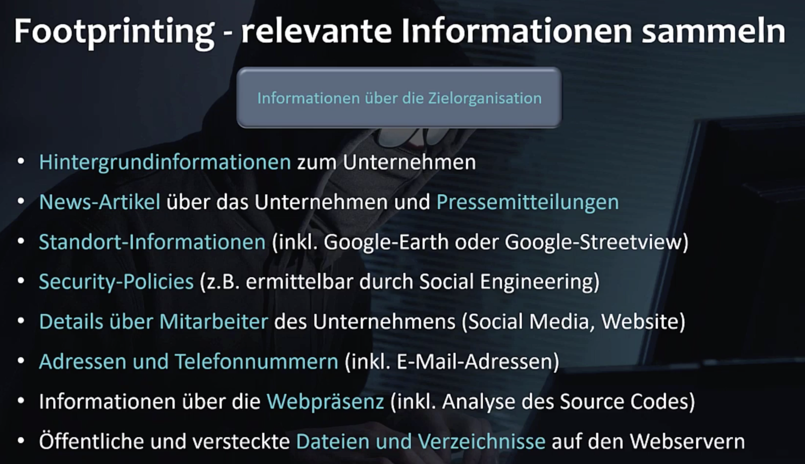
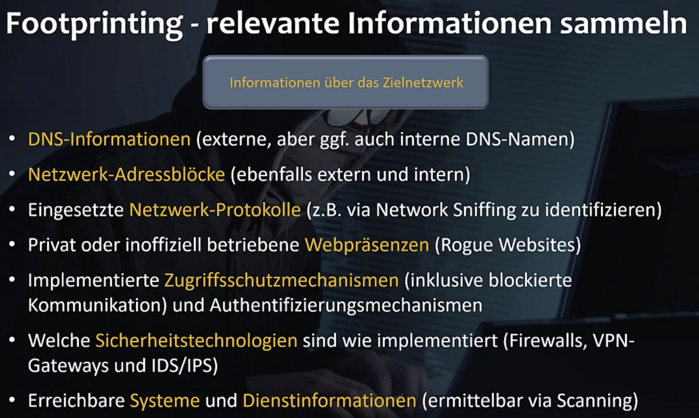
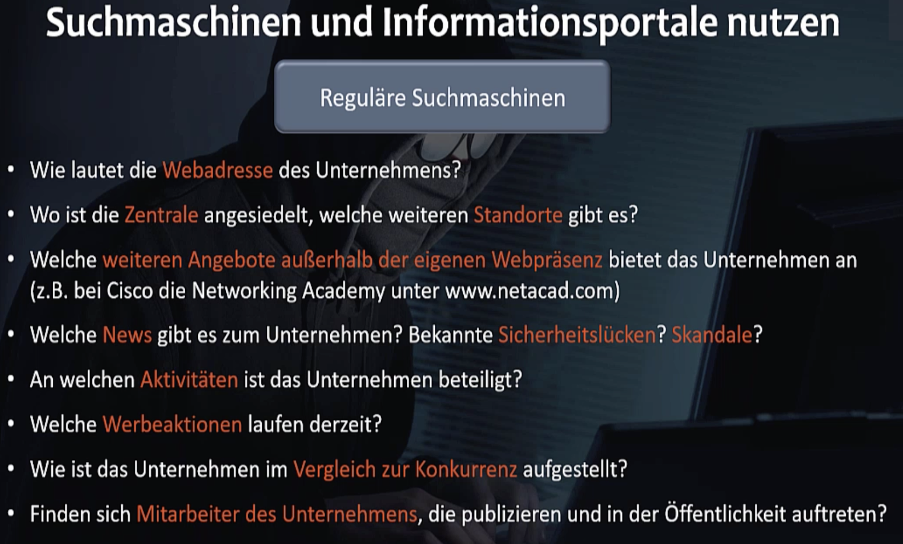

# Section 7: Informationsbeschaffung: Footprinting und Reconnaissance

Phase die am längsten dauert. Ziel ist systematisch Schwachstellen für einen Angriff zu finden.

- **Reconnaissance**: Oberbegriff, information gathering
- **Footprinting**:  Sammlung öffentlich zugänglicher Daten, OSINT – Open Source Intelligence, Passiv: keine Kommunikation mit dem Ziel.
- **Scanning**: Aktive Phase, Port Scan, Vulnerability Scan, [Banner Grabbing](https://en.wikipedia.org/wiki/Banner_grabbing), direkte Kommunikation mit dem Ziel – Gefahr der Entdeckung
- **Enumeration**: Systematisches abfragen von Diensten und Systemen, Ziel Übersicht über das Ziel-System, 

Begriffe sind nicht so scharf definiert!

**Suchmaschinen** (Google, ...) liefern viele Informationen über das Ziel. Es gibt spezialisierte Suchmaschinen.

Mehrere Suchmaschinen verwenden (Google, Bing, Yahoo, DuckDuckGo, Baidu, Yandex, ...). Teilweise sehr unterschiedlich.

**Netcraft**: , Sucht subdomains und liefert genauere Informationen

Internet-**Archive** (WayBack Machin), speichern alte Web-Site informationen.

**Shodan** , sammelt Banner Daten von z.B. IoT Geräte, Router, ... . Registrierung notwendig, Filter möglich, 

