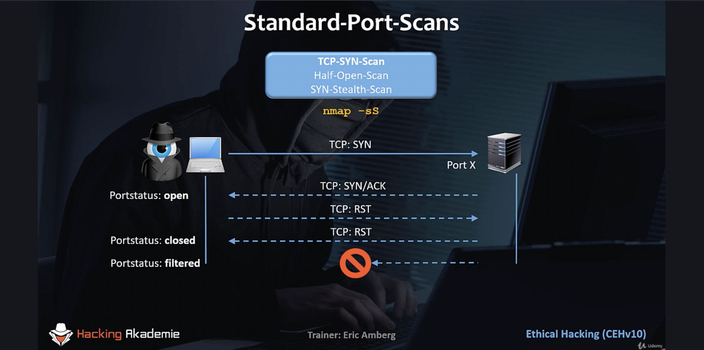
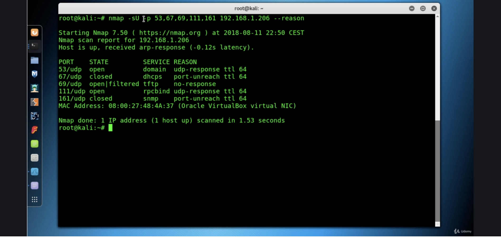
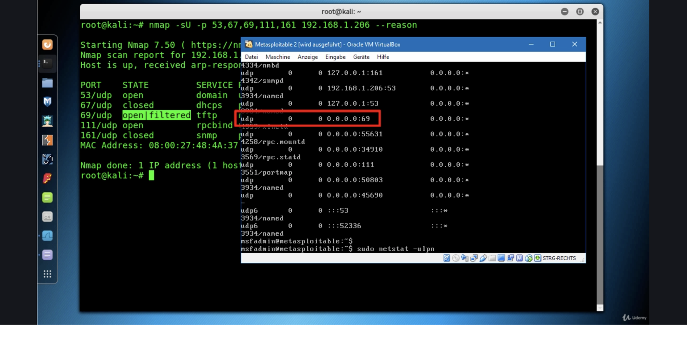
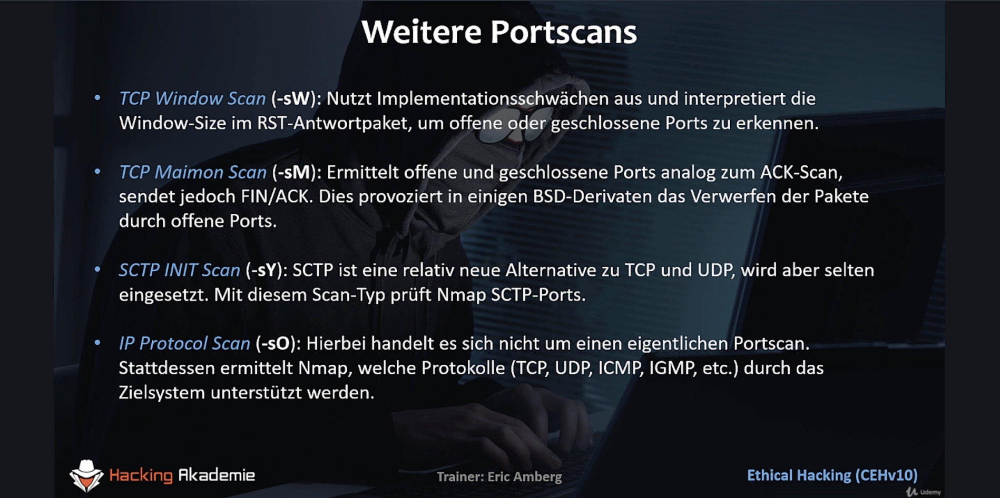

[Nmap: the Network Mapper - Free Security Scanner](https://nmap.org)

Dieses Tool dient dazu aktive Hosts in Netzwerken zu ermitteln (**Host Discovery**) und diese weiters auf angebotene Dienste zu durchforsten (**Port Scan**). nmap erzeugt dafür eine große Menge an Netzwerk Paketen und wertet die Rückantworten aus.

Wird gerne in Filmen verwendet wenn es um Hacking geht ([[Nmap In The Movies](https://nmap.org/movies/)])

> Nmap (“Network Mapper”) is an open source tool for network exploration and security auditing. It was designed to rapidly scan large networks, although it works fine against single hosts.


> One of Nmap's most exciting new features is the [Nmap Scripting Engine](https://nmap.org/book/nse.html), which extends Nmap's functionality using the simple and efficient [Lua](http://lua.org/) programming language. [...] you can also write your own


## Vorbereitendes

Eigene IP Adresse und Subnetz-Maske ermitteln

```bash
$ ifconfig | grep inet
inet 192.168.178.64  netmask 255.255.255.0  broadcast 192.168.178.255
...
```

Viele Funktionen von nmap stehen nur dann zur Verfügung wenn dieses als root gestartet wird:

```bash
# unter Kali Linux geht "su -" nicht
$ sudo -i 
```


## Allgemeines

nmap arbeitet in 2 Stufen die nacheinander ablaufen:

- Host Discovery (auch Ping Scan)
- Port Scan der aktiven Hosts

Scan eines ganzen Subnets:

```bash
$ nmap 192.168.178.0/24
```

Das Ergebnis ist eine Liste aller aktiven Hosts und für jeden Host die offenen Ports

Schalter `-v`: Verbose, man kann mitschauen was `nmap` macht


### Ping Scan

**Host Discovery** wird durch den sogenannte **Ping Scan** erledigt. 

- Nicht nur "Ping", d.h. ICMP Typ 0 (Echo Reply) und 8 (Echo Request)
- Sondern ein Ping Scan ist jede Kommunikation die eine Reaktion des Zielsystems provoziert (weil ICMP Type 8 von vielen Systemen ignoriert werden). 
- Wenn der nmap Host im gleichen Sub-Net ist werden z.B. ausschließlich ARP Requests versandt, weil jeder Host auf eine solche Anfrage antwortet. 

Option: `-sn` ... Port Scan wird unterbunden, es wird ausschließlich Host Discovery ausgeführt.

```bash
$ sudo nmap -sn 192.168.178.0/24
Starting Nmap 7.91 ( https://nmap.org ) at 2021-04-30 09:54 EDT
Nmap scan report for fritz.box (192.168.178.1)
Host is up (0.0037s latency).
MAC Address: E0:28:6D:7B:FA:91 (AVM Audiovisuelles Marketing und Computersysteme GmbH)
Nmap scan report for Ventress.fritz.box (192.168.178.21)
Host is up (0.0056s latency).
MAC Address: 00:11:32:65:91:7F (Synology Incorporated)
Nmap scan report for Beoplay-M3-28720449.fritz.box (192.168.178.22)
Host is up (0.10s latency).
MAC Address: 50:1E:2D:04:DD:86 (StreamUnlimited Engineering GmbH)
Nmap scan report for Beoplay-M5-28186652.fritz.box (192.168.178.23)
Host is up (0.10s latency).
MAC Address: AC:89:95:F5:AA:91 (AzureWave Technology)
...
```

Im Verbose Mode sieht man, dass nmap alle 255 Hosts durchprobiert:

```bash
$ nmap -sn -v 192.168.178.0/24
```


#### Ping Scan Optionen

Ping Scan komplett deaktivieren: `-Pn`, in diesem Fall werden die Ports auch dann gescannt wenn der Host nicht als aktiv erkannt wurde.

ICMP Echo Request (Typ 8): `nmap` Option: `-PE`

ICMP Timestamp Request (Typ 13):  `nmap` Option: `-PP`

TCP SYN auf Port 443 (https):  `nmap` Option: `-PS443`

TCP ACK auf Port 80 (http):  `nmap` Option: `-PA80`

Nur DNS reverse look-up (=list scan): `-sL`, nmap versucht alle angegebenen IP Adressen in Host-Namen aufzulösen, über DNS.

Beispiel für `scanme.nmap.org`:

```bash
# nmap -sL 45.33.32.0/24
```

UDP Scan an Port 40125: `-PU`. Dies ist ein selten bis kaum benutzter Port – d.h. nicht an einen Server Prozess gebunden. Das System antwortet dann standardmäßig mit ICMP Typ 3 "destination unreachable" code 3 "port unreachable". Aus dem erhalten einer Antwort kann NMAP schließen dass das System aktiv ist. 

Man kann mit `-PU` auch direkt Ports ansprechen die möglicherweise an einen Dienst gebunden sind. Diese Dienste würden allerdings auf ein leeres UDP Paket nicht reagieren, aber ein halbwegs gültiger Request mit Payload führt sehr wahrscheinlich zu einer Fehlerrückmeldung. Daher enthält nmap für einige Ports eine passende Payload, siehe `/usr/share/nmap/nmap-payloads`.

Angeben der UDP Portnummer: `-PU53` , `-PU3,67,161`. Wenn vorhanden werden nmap-payloads Daten gesendet.


## Port Scan

Nach dem PING Scan erfolgt der Port Scan.

Verschieden Port Scan Typen

- TCP SYN Scan (Default) `nmap -sS`
- TCP Connect Scan `nmap -sT` – Normaler TCP connect (langsamer aber keine root Rechte notwendig)
- UDP Scan `nmap -sU` – dauern sehr lange


### TCP SYN Scan

Das ist der Standard Port Scan, wenn root Rechte vorhanden. Hinweis: Für einen SYN Scan braucht nmap root Rechte da raw pakete erzeugt werden müssen.



TCP SYN Paket, d.h. erstes Paket des TCP Verbindungsaufbaus (3-way Handshake). nmap bricht aber im dritten Paket (nach Empfang von SYN/ACK) durch RST die Verbindung wieder ab (Zielsysteme protokollieren dies dann meist nicht).

Mit SYN/ACK akzeptiert der Server die Verbindung (**open**). RST bedeutet einen geschlossenen Port (**closed**, kein Service darauf gebunden). Kommt keine Antwort (**filtered**) so hat eine Firewall die Pakete gefiltert.

Normaler 3-way Handshake:


### UDP Scan

mit eingeschränkte Ports

```bash
# nmap -sU -p 53,67,69,111,161 192.168.178.1 --reason
#  53 ... DNS
#  67 ... DHCP
#  69 ... TFTP
# 111 ... RPC
# 161 ... SNMP
# --reason : Grund für den Port Status anzeigen
```



Ports die keinen Server Prozess gebunden haben antworten mit ICMP Port Unreachable.

Bei Ports zu denen keine Standard Payload verfügbar ist (Port 69) kommt keine Antwort daher "open|filtered" "no-response". filtered deswegen weil eine Firewall den Datentransfer evtl. gefiltert hat und nmap das nicht unterscheiden kann.

Am Beispiel einer metasploitable VM kann man das sehen – feststellen ob ein UDP Port offen ist:

```bash
$ sudo netstat -ulpn
```

Damit kann z.B. verfiziert werden dass in Metasploitable der Port 69 offen ist. Und daher der Ports State "open|filtered".




### Gescannte Ports festlegen

Standardmäßig scannt nmap die 1000 am häufigst verwendeten Ports, siehe `/usr/share/nmap/nmap-services`

nmap scanned die 1000 häufigsten Ports:

```bash
# nmap 192.168.178.71
Starting Nmap 7.91 ( https://nmap.org ) at 2021-05-01 06:37 EDT
Nmap scan report for 192.168.178.71
Host is up (0.00086s latency).
Not shown: 977 closed ports
PORT     STATE SERVICE
21/tcp   open  ftp
22/tcp   open  ssh
23/tcp   open  telnet
25/tcp   open  smtp
53/tcp   open  domain
80/tcp   open  http
111/tcp  open  rpcbind
139/tcp  open  netbios-ssn
445/tcp  open  microsoft-ds
512/tcp  open  exec
513/tcp  open  login
514/tcp  open  shell
1099/tcp open  rmiregistry
1524/tcp open  ingreslock
2049/tcp open  nfs
2121/tcp open  ccproxy-ftp
3306/tcp open  mysql
5432/tcp open  postgresql
5900/tcp open  vnc
6000/tcp open  X11
6667/tcp open  irc
8009/tcp open  ajp13
8180/tcp open  unknown
MAC Address: 08:00:27:04:0A:09 (Oracle VirtualBox virtual NIC)

Nmap done: 1 IP address (1 host up) scanned in 0.28 seconds
```

`-F` scanned die häufigsten 100 Ports

```bash
# nmap -F 192.168.178.71
Starting Nmap 7.91 ( https://nmap.org ) at 2021-05-01 06:39 EDT
Nmap scan report for 192.168.178.71
Host is up (0.00050s latency).
Not shown: 82 closed ports
PORT     STATE SERVICE
21/tcp   open  ftp
22/tcp   open  ssh
23/tcp   open  telnet
25/tcp   open  smtp
53/tcp   open  domain
80/tcp   open  http
111/tcp  open  rpcbind
139/tcp  open  netbios-ssn
445/tcp  open  microsoft-ds
513/tcp  open  login
514/tcp  open  shell
2049/tcp open  nfs
2121/tcp open  ccproxy-ftp
3306/tcp open  mysql
5432/tcp open  postgresql
5900/tcp open  vnc
6000/tcp open  X11
8009/tcp open  ajp13
MAC Address: 08:00:27:04:0A:09 (Oracle VirtualBox virtual NIC)

Nmap done: 1 IP address (1 host up) scanned in 0.20 seconds
```

Anzahl der gescannten Top Ports einstellen mit `--top-ports <nr>`. Das zeigt auch geschlossene Ports an.

```bash
$ nmap --top-ports 10 192.168.178.71
Starting Nmap 7.91 ( https://nmap.org ) at 2021-05-01 06:42 EDT
Nmap scan report for 192.168.178.71
Host is up (0.00050s latency).

PORT     STATE  SERVICE
21/tcp   open   ftp
22/tcp   open   ssh
23/tcp   open   telnet
25/tcp   open   smtp
80/tcp   open   http
110/tcp  closed pop3
139/tcp  open   netbios-ssn
443/tcp  closed https
445/tcp  open   microsoft-ds
3389/tcp closed ms-wbt-server
MAC Address: 08:00:27:04:0A:09 (Oracle VirtualBox virtual NIC)

Nmap done: 1 IP address (1 host up) scanned in 0.20 seconds
```

Ports aus dem Scan ausschließen:

```bash
$ nmap --exclude-ports 22,25,80  192.168.178.71
```

Bestimmte ports scannen

```bash
$ nmap -p 22,25,80  192.168.178.71
```


### Besondere Portscans

 ```bash
 # nmap -sA
 ```

TCP Scan mit gesetztem ACK Flag. Dies ermittelt ob ein Port gefiltert wird. Hintergrund: Firewalls lassen ACK Pakete eher durch als SYN Pakete. Dient dazu Firewall Konfigurationen zu ermitteln. Funktioniert allerdings nicht bei neueren Stateful Firewalls. 

`-sN/sF/sX`: TCP Null, FIN, and Xmas scans

Dienen dazu RST Pakete vom Ziel zu provozieren.

TCP Spezifikation: Wenn ein TCP Paket empfangen die weder SYN, ACK noch RST enthalten. Offener Port: verwirft diese Pakte. Ein geschlossener Port sendet ein RST Paket. Nicht alle Systeme halten sich an diese Spezifikation daher bietet nmap 3 Varianten an. 

- `-sN` TCP Null – kein TCP Flag gesetzt

- `-sF`: FIN – nur FIN Flag wird gesetzt
- `-sX`: Xmas – FIN, PUSH und URG wird gesetzt  (leuchtet wie ein Christbaum)

Dienen auch zum austricksen älterer Firewall-Implementierungen – funktioniert aber nicht mehr so gut.

Siehe [TCP-Port-Scanning: Das sollten Sie über die unterschiedlichen Techniken wissen](https://www.computerweekly.com/de/ratgeber/TCP-Port-Scanning-Das-sollten-Sie-ueber-die-unterschiedlichen-Techniken-wissen)




Besonderer Scan: TCP-IDLE-Scan `-sI` (auch IP ID Scan), nutzt Fragment Identification Numer und einen Zombie Host. (Siehe Udemy, Eric Amberg, Video 88 Besondere Portscans, ab 6:20), Scan ist gut um den Angreifer zu verstecken


### Dienst- und Versions–Erkennung

Mit `-sV`:

```bash
$ nmap -sV 192.168.178.71
Starting Nmap 7.91 ( https://nmap.org ) at 2021-05-01 10:29 EDT
Nmap scan report for 192.168.178.71
Host is up (0.00047s latency).
Not shown: 977 closed ports
PORT     STATE SERVICE     VERSION
21/tcp   open  ftp         vsftpd 2.3.4
22/tcp   open  ssh         OpenSSH 4.7p1 Debian 8ubuntu1 (protocol 2.0)
23/tcp   open  telnet      Linux telnetd
25/tcp   open  smtp        Postfix smtpd
53/tcp   open  domain      ISC BIND 9.4.2
80/tcp   open  http        Apache httpd 2.2.8 ((Ubuntu) DAV/2)
111/tcp  open  rpcbind     2 (RPC #100000)
139/tcp  open  netbios-ssn Samba smbd 3.X - 4.X (workgroup: WORKGROUP)
445/tcp  open  netbios-ssn Samba smbd 3.X - 4.X (workgroup: WORKGROUP)
512/tcp  open  exec?
513/tcp  open  login       OpenBSD or Solaris rlogind
514/tcp  open  tcpwrapped
1099/tcp open  java-rmi    GNU Classpath grmiregistry
1524/tcp open  bindshell   Metasploitable root shell
2049/tcp open  nfs         2-4 (RPC #100003)
2121/tcp open  ftp         ProFTPD 1.3.1
3306/tcp open  mysql       MySQL 5.0.51a-3ubuntu5
5432/tcp open  postgresql  PostgreSQL DB 8.3.0 - 8.3.7
5900/tcp open  vnc         VNC (protocol 3.3)
6000/tcp open  X11         (access denied)
6667/tcp open  irc         UnrealIRCd
8009/tcp open  ajp13       Apache Jserv (Protocol v1.3)
8180/tcp open  http        Apache Tomcat/Coyote JSP engine 1.1
MAC Address: 08:00:27:04:0A:09 (Oracle VirtualBox virtual NIC)
Service Info: Hosts:  metasploitable.localdomain, irc.Metasploitable.LAN; OSs: Unix, Linux; CPE: cpe:/o:linux:linux_kernel

Service detection performed. Please report any incorrect results at https://nmap.org/submit/ .
Nmap done: 1 IP address (1 host up) scanned in 64.28 seconds
```

Scan dauert viel länger

nmap nutzt zuerst **Banner Grabbing** um Bezeichnung und Version von Diensten zu ermitteln. Falls das nicht geht wird `/usr/share/nmap/nmap-services-probes` verwendet, darin sind Tests festgelegt (z.B. bestimmte Requests mit erwarteten Responses) die SW-Versionen erkennen können.


### OS-Erkennung

```bash
$ nmap -O 192.168.178.71
Starting Nmap 7.91 ( https://nmap.org ) at 2021-05-01 10:32 EDT
Nmap scan report for 192.168.178.71
Host is up (0.00051s latency).
Not shown: 977 closed ports
PORT     STATE SERVICE
21/tcp   open  ftp
22/tcp   open  ssh
...
8009/tcp open  ajp13
8180/tcp open  unknown
MAC Address: 08:00:27:04:0A:09 (Oracle VirtualBox virtual NIC)
Device type: general purpose
Running: Linux 2.6.X
OS CPE: cpe:/o:linux:linux_kernel:2.6
OS details: Linux 2.6.9 - 2.6.33
Network Distance: 1 hop

OS detection performed. Please report any incorrect results at https://nmap.org/submit/ .
Nmap done: 1 IP address (1 host up) scanned in 1.82 seconds
```

Durch TCP IP Stack fingerprinting, d.h. durch spezielle Eigenheiten der TCP und IP Kommunikation.


### Firewalls, IDS-Vermeidung

#### Fragmentierung

```bash
$ nmap -f
```

IP  Pakete werden in 8 Bytes große Fragmente zerlegt (der TCP Header 20 Bytes wird in 3 Fragmente zerlegt). Firewalls, IDS, IPS (Security Komponenten) bauen oftmals aus Performance-Gründe Fragment nicht wieder zusammen und lassen diese durch.

16 Bytes Segmente:

```bash
$ nmap -f -f
```


#### Decoy Scan

`-D`

(=Köder) Verschleiern der eigenen IP Adresse. Es werden mehrere Absender IP Adressen zum Scannen verwendet (können angegeben werden). Von diesen IP Adressen ist aber nur eine die richtige.


#### Spoofen der Absenderadresse

```bash
$ nmap -S <Absender IP>
```

Ablenkungsmanöver – da keine Antwort empfangen werden kann.


#### Verlangsamen des Scans

```bash
$ nmap -T sneaky
```

Vermeidet, dass IDS und IPS Systeme den Scan erkennen weil die einzelnen Pakete zeitlich weit auseinanderliegen.


## Ausgabe Optionen

Im Textformat in Datei schreiben:

```bash
$ nmap -oN nmap-results.txt 192.168.178.71
```

Grepable Output (`-oG`)

```bash
$ nmap -oG nmap-results.grep 192.168.178.71
```

Ausgabe in einem durch Linux Tools (grep, cut, ...) lesbaren Format. Jeder Host in einer Zeile, Felder durch `'\t'` getrennt, (siehe [Grepable Output (-oG)](https://nmap.org/book/output-formats-grepable-output.html))


Als XML Datei (empfohlen):

```bash
$ nmap -oX nmap-result.xml -sV -O --webxml 192.168.178.71
#
$ firefox nmap-result.xml
```

`--webxml` wenn man sich die Datei im Browser anzeigen lassen will (stellt xsl richtig).


## NMAP Scripting Engine (NSE)

Erweiterungen von nmap in Lua Scripts.

In `/usr/share/nmap/scripts`

Eine Auswahl besonders nützlicher Skripte ausführen:

```bash
$ nmap -sC -F

Starting Nmap 7.91 ( https://nmap.org ) at 2021-05-02 05:29 EDT
Nmap scan report for 192.168.178.71
Host is up (0.00092s latency).
Not shown: 82 closed ports
PORT     STATE SERVICE
21/tcp   open  ftp
|_ftp-anon: Anonymous FTP login allowed (FTP code 230)
| ftp-syst: 
|   STAT: 
| FTP server status:
|      Connected to 192.168.178.64
|      Logged in as ftp
|      TYPE: ASCII
|      No session bandwidth limit
|      Session timeout in seconds is 300
|      Control connection is plain text
|      Data connections will be plain text
|      vsFTPd 2.3.4 - secure, fast, stable
|_End of status
22/tcp   open  ssh
| ssh-hostkey: 
|   1024 60:0f:cf:e1:c0:5f:6a:74:d6:90:24:fa:c4:d5:6c:cd (DSA)
|_  2048 56:56:24:0f:21:1d:de:a7:2b:ae:61:b1:24:3d:e8:f3 (RSA)
23/tcp   open  telnet
25/tcp   open  smtp
|_smtp-commands: metasploitable.localdomain, PIPELINING, SIZE 10240000, VRFY, ETRN, STARTTLS, ENHANCEDSTATUSCODES, 8BITMIME, DSN, 
|_ssl-date: 2021-05-01T12:28:18+00:00; -21h01m36s from scanner time.
| sslv2: 
|   SSLv2 supported
|   ciphers: 
|     SSL2_RC2_128_CBC_WITH_MD5
|     SSL2_DES_64_CBC_WITH_MD5
|     SSL2_RC2_128_CBC_EXPORT40_WITH_MD5
|     SSL2_RC4_128_WITH_MD5
|     SSL2_DES_192_EDE3_CBC_WITH_MD5
|_    SSL2_RC4_128_EXPORT40_WITH_MD5
53/tcp   open  domain
| dns-nsid: 
|_  bind.version: 9.4.2
80/tcp   open  http
|_http-title: Metasploitable2 - Linux
111/tcp  open  rpcbind
| rpcinfo: 
|   program version    port/proto  service
|   100000  2            111/tcp   rpcbind
|   100000  2            111/udp   rpcbind
|   100003  2,3,4       2049/tcp   nfs
|   100003  2,3,4       2049/udp   nfs
|   100005  1,2,3      35315/udp   mountd
|   100005  1,2,3      47436/tcp   mountd
|   100021  1,3,4      33844/tcp   nlockmgr
|   100021  1,3,4      52127/udp   nlockmgr
|   100024  1          40012/tcp   status
|_  100024  1          53330/udp   status
139/tcp  open  netbios-ssn
445/tcp  open  microsoft-ds
513/tcp  open  login
514/tcp  open  shell
2049/tcp open  nfs
2121/tcp open  ccproxy-ftp
3306/tcp open  mysql
| mysql-info: 
|   Protocol: 10
|   Version: 5.0.51a-3ubuntu5
|   Thread ID: 15
|   Capabilities flags: 43564
|   Some Capabilities: SupportsTransactions, SupportsCompression, LongColumnFlag, Support41Auth, Speaks41ProtocolNew, SwitchToSSLAfterHandshake, ConnectWithDatabase
|   Status: Autocommit
|_  Salt: y-sz0z8E3nR08h&!o0>(
5432/tcp open  postgresql
|_ssl-date: 2021-05-01T12:28:00+00:00; -21h01m36s from scanner time.
5900/tcp open  vnc
| vnc-info: 
|   Protocol version: 3.3
|   Security types: 
|_    VNC Authentication (2)
6000/tcp open  X11
8009/tcp open  ajp13
|_ajp-methods: Failed to get a valid response for the OPTION request
MAC Address: 08:00:27:04:0A:09 (Oracle VirtualBox virtual NIC)

Host script results:
|_clock-skew: mean: -20h01m35s, deviation: 2h00m00s, median: -21h01m36s
|_nbstat: NetBIOS name: METASPLOITABLE, NetBIOS user: <unknown>, NetBIOS MAC: <unknown> (unknown)
| smb-os-discovery: 
|   OS: Unix (Samba 3.0.20-Debian)
|   Computer name: metasploitable
|   NetBIOS computer name: 
|   Domain name: localdomain
|   FQDN: metasploitable.localdomain
|_  System time: 2021-05-01T08:27:59-04:00
| smb-security-mode: 
|   account_used: guest
|   authentication_level: user
|   challenge_response: supported
|_  message_signing: disabled (dangerous, but default)
|_smb2-time: Protocol negotiation failed (SMB2)

Nmap done: 1 IP address (1 host up) scanned in 46.75 seconds
```

`-F` nur die 100 wichtigsten Ports. Dauert ein wenig länger wegen der Skript-Ausführung.

Einzelnes Starten von Skripts:

```bash
$ nmap --script http-title,mysql-info
```

Die Skripte sind eine Fundgrube an Informationen. [Liste der Skripte](https://nmap.org/nsedoc/)

Die erhaltenen Informationen können Hinweise auf mögliche Schwachstellen bietet sind allerdings kein Vulnerability-Scanning.


## Best Practice

Die `-A` Option beinhaltet:  `-sV` Dienst- und Versionerkennung, `-O` Betriebssystemerkennung, `-sC` Standard Skripte und traceroute und einige Timer Optimierungen.

Durchführen eines ersten Scans:

```bash
$ wget -A -T4 -F -v <Ziel>
```

`-T4` ... Moderate Beschleunigung des Scans

`-F` ... 100 wichtigste Port

`-v` ... Verbose


## Kurzübersicht

Default Scan eines ganzen Subnets (CIDR Notation):

```bash
$ nmap 192.168.178.0/24
```

Scan eines einzelnen Hosts:

```bash
$ nmap 192.168.178.100
$ nmap scanme.nmap.org
```


HOST DISCOVERY:

  `-sL`: List Scan - simply list targets to scan
  `-sn`: Ping Scan - disable port scan
  `-Pn`: Treat all hosts as online -- skip host discovery
  `-PS/PA/PU/PY[portlist]`: TCP SYN/ACK, UDP or SCTP discovery to given ports
  `-PE/PP/PM`: ICMP echo, timestamp, and netmask request discovery probes

SCAN TECHNIQUES:
  `-sS/sT/sA/sW/sM`: TCP SYN/Connect()/ACK/Window/Maimon scans
  `-sU`: UDP Scan
  `-sN/sF/sX`: TCP Null, FIN, and Xmas scans

SERVICE/VERSION DETECTION:
  `-sV: Probe open ports to determine service/version info

OS DETECTION:
  `-O`: Enable OS detection

PORT SPECIFICATION AND SCAN ORDER:
  `-p <port ranges>`: Only scan specified ports
    Ex: `-p22`; `-p1-65535`; `-p U:53,111,137,T:21-25,80,139,8080,S:9`
  `--exclude-ports <port ranges>`: Exclude the specified ports from scanning
  `-F`: Fast mode - Scan fewer ports than the default scan
  `-p-`: scan all Ports

TIMING AND PERFORMANCE:
  `-T<0-5>`: Set timing template (higher is faster), 3=Standard
  `-T paranoid|sneaky|polite|normal|aggressive|insane`: Set a timing template

OUTPUT:

`--reason`: Display the reason a port is in a particular state

`-v` ... Verbose Mode


## Zenmap

GUI Frontend. Wird nicht mehr gewartet, daher in Kali Linux nicht mehr enthalten.


## Quellen

[Tutorial](https://hackertarget.com/nmap-tutorial/)


