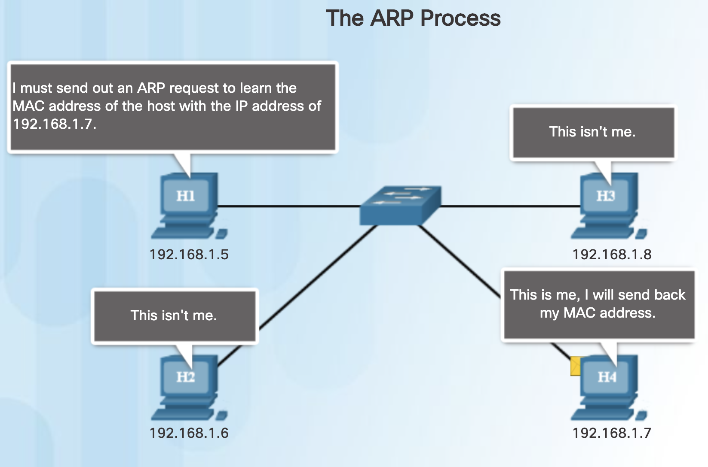

Das ARP – **Address Resolution Protocol** –  dient dazu Link Layer Adressen aufgrund von Network Layer Adressen zu finden.

Beschreibung: 

- Host A will **an Host B** ein IP Paket schicken. 
- Die Hosts haben **konfigurierte IP Adressen** und **Netzwerkmasken** (per DHCP oder manuell). z.B. Host A (192.168.1.5), Host B (192.168.1.7), Subnetmask (255.255.255.0)
- Host B befindet sich **im gleichen Subnet** wie Host A (wird über die Subnetmask festgestellt). 
- Das Paket **kann also direkt** von Host A im lokalen Netzwerk (ohne Routerbeteiligung) an Host B gesendet werden. 
- Dazu wird das IP Paket in einen **Ethernet Frame verpackt** und mit der MAC Adresse von Host B versehen. 
- Eine MAC Adresse ist fix im Gerät gespeichert (bei der Herstellung) und dem **Host A noch nicht bekannt**.
- Um die MAC Adresse von Host B zu ermitteln schickt Host A einen **ARP Request** (broadcast Ethernet Frame): "192.168.1.5 an alle – wer von euch hat die IP Adresse 192.168.1.7?"
- Host B antwortet mit **ARP Reply** (unicast Ethernet Frame) an Host A: "ich und ich habe MAC Adresse A1:A1:A1:A1:A1:A1").
- Alle derart gelernten MAC Adressen werden im **ARP cache** von Host A gespeichert.

Der ARP Vorgang muss nur beim ersten Kommunikationsversuch durchgeführt werden, später braucht Host A nur im ARP Cache nachzusehen.

## Gratuitous ARP Reply

Zur Beschleunigung: neues Gerät im Netzwerk kann ein gratuitous (de: grundlos) ARP Reply als broadcast schicken. Damit lernen alle Hosts die das empfangen die MAC und IP Adresse dieses Geräts.

Dieses Verhalten wird beim ARP cache poisoning ausgenutzt.

## ARP Cache

Jeder neu in den ARP Cache aufgenommene Eintrag erhält eine zufällig gewählte Lebensdauer zwischen **15 und 45 Sekunden** zugewiesen [[serverfault 2018](https://serverfault.com/a/924165)]. Dies gilt in neueren Systemen, früher verwendete Werte sind 60 Sekunden in Linux und 2 Minuten in Windows [[superuser 2018](https://superuser.com/a/1345151)]. Die Zeit wird jedesmal neu gestartet wenn der ARP Eintrag verwendet wird.

## ARP und WLAN

ARP wird in 802.3 und 802.11 gleichermaßen verwendet

