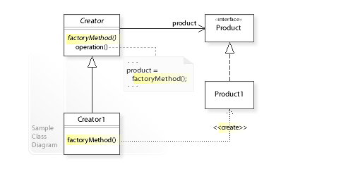

# Factory Method

[wikipedia – Factory method pattern](https://en.wikipedia.org/wiki/Factory_method_pattern)

In class-based programming, the **factory method pattern** is a creational pattern that uses factory methods to deal with the problem of creating objects without having to specify the exact class of the object that will be created. This is done by creating objects by calling a factory method—either specified in an interface and implemented by child classes, or implemented in a base class and optionally overridden by derived classes—rather than by calling a constructor.


## Variante 1

```csharp
// (c) Waser
using System;
using System.Collections.Generic;
using System.Linq;
using System.Text;
using System.Threading.Tasks;

namespace FactoryMethodTheoryCode
{
    class Program
    {
        static void Main(string[] args)
        {
            Creator c = new Creator();
            IProduct product;

            //IProduct p = new ProductA();
            
            for (int i = 1; i <= 12; i++)
            {
                product = Creator.newInstance(i);
                Console.WriteLine("Avocados " + product.ShipFrom());
            }

            Console.ReadLine();
        }
    }

    interface IProduct
    {
        string ShipFrom();
    }

    class ProductA : IProduct
    {
        public String ShipFrom()
        {
            return " from South Africa";
        }
    }
    class ProductB : IProduct
    {
        public String ShipFrom()
        {
            return " from Spain";
        }
    }
    class DefaultProduct : IProduct
    {
        public String ShipFrom()
        {
            return "not available";
        }
    }

    class Creator
    {
        public static IProduct newInstance(int month)
        {
            if (month >= 4 && month <= 11)
            {
                return new ProductA();
            }
            else
            {
                if (month == 1 || month == 2 || month == 12)
                {
                    return new ProductB();
                }
                else
                {
                    return new DefaultProduct();
                }
            }
        }
    }
}

```

---

**Übung (Meal Decider)**

Schreibe mit Hilfe des **factory method** Design Patterns ein Programm das für jede Stunde des Tages ein bestimmtes Objekt mit **IMeal** interface erzeugt. Beispiel:

```csharp
interface IMeal
{
  string Eat();
}

class Müsli : IMeal
{
  public string Eat()
  {
    return "Müsli essen";
  }
}
```

Es gibt auch Stunden des Tages in denen es nichts zu essen gibt, in diesem Fall liefert die factory method eine Nullreferenz.

---

**Lösung:**

```csharp
// (c) Waser
using System;
using System.Collections.Generic;
using System.Linq;
using System.Text;
using System.Threading.Tasks;

namespace FactoryMethodTest2
{
    class Program
    {
        static void Main(string[] args)
        {
            int i;

            //for(i = 0; i <= 23; i++)
            {
                IMeal meal = MealDecider.GetMeal();

                if(meal != null)
                {
                    Console.WriteLine(meal.Eat());
                }
                else
                {
                    Console.WriteLine(": Es gibt nichts zu essen!");
                }
            }

            Console.ReadLine();
        }
    }

    class MealDecider
    {
        // Factory Method
        public static IMeal GetMeal()
        {
            int hour = DateTime.Now.Hour;

            switch(hour)
            {
                case 0:
                case 1:
                case 2:
                case 3:
                case 4:
                case 5: return null;

                case 6:
                case 7: return new Müsli();

                case 8: return null;

                case 9: return new Jausenweckerl();

                case 10:
                case 11: return null;

                case 12:
                case 13: return new Schnitzel();

                case 14:
                case 15: return null;

                case 16: return new Apfel();

                case 17: return null;

                case 18:
                case 19: return new Salat();

                case 20:
                case 21:
                case 22:
                case 23: return null;

                default: return null;
            }
        }
    }

    interface IMeal
    {
        string Eat();
    }

    class Müsli : IMeal
    {
        public string Eat()
        {
            return "Müsli essen";
        }
    }

    class Jausenweckerl : IMeal
    {
        public string Eat()
        {
            return "Jausenweckerl essen";
        }
    }

    class Schnitzel : IMeal
    {
        public string Eat()
        {
            return "Schnitzel essen";
        }
    }

    class Apfel : IMeal
    {
        public string Eat()
        {
            return "Apfel essen";
        }
    }

    class Salat : IMeal
    {
        public string Eat()
        {
            return "Salat essen";
        }
    }
}

```


## Variante 2




[w3design Factory Method](http://w3sdesign.com/?gr=c03&ugr=proble#gf)

```csharp
using System;

namespace factory
{
    class Program
    {
        interface Fruit {
            public string GetName();
            public string Squeeze();
        }

        abstract class FruitPile {
            public Fruit fruit;
            public abstract Fruit factoryMethod();
            // design algorithms: w/o concrete class knowledge
            public void SqeezeIt() {
                // lazy instantiation
                if (fruit==null) {
                    fruit=factoryMethod();
                }
                System.Console.WriteLine($"squeezing {fruit.GetName()} gives {fruit.Squeeze()} ");
                fruit.Squeeze();
            }
        }

        class Apple : Fruit {
            public string GetName() {
                return "Apple";
            }
            public string Squeeze() {
                return "Apple juice";
            }
        }

        class ApplePile : FruitPile
        {
            public override Fruit factoryMethod() {
                return new Apple();
            }
        }

        static void Main(string[] args)
        {
            var applePile = new ApplePile();
            applePile.SqeezeIt();

        }
    }
}
	
```

