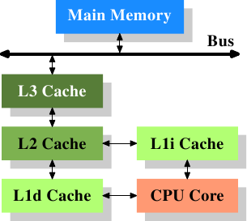
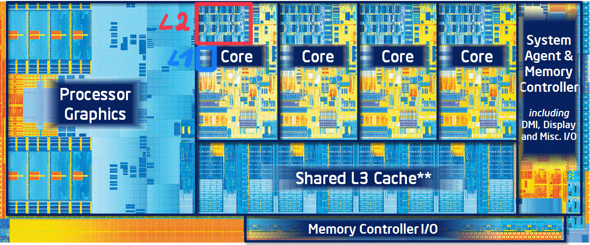

# Speicher

*Bild: CPU Bus Speicher (evtl. vom vorhergehenden Kapitel)*

Für Programme und Daten, von der CPU aus über den Bus direkt und byteweise adressierbar.

-   Flüchtiger Speicher (volatile, Strom weg => Daten weg)
    -   RAM - Random Access Memory 
        -   SRAM – Static RAM (D Flip Flops, schnell, teuer), nur für spezielle Anwendungen
        -   **SDRAM** – Synchronous Dynamic RAM (Kondensator, langsamer, billiger), der Standard!

- Nicht-flüchtiger Speicher (non volatile, behält die Daten bei Spannungsverlust)
  - ROM - Read Only Memory 
    - EEPROM – electrically erasable programmable read-only memory, byteweise löschen und neu programmieren möglich. Lebensdauer ca. 1 Mio. Zyklen. Meist nur wenige MB und teuer.
    - **Flash** – spezieller günstiger EEPROM Typ der nur in großen Blöcken (>=512 Bytes) gelöscht werden kann. Lebensdauer ca. 10.000 Zyklen. Im GB/TB Bereich verfügbar. Verwendung in SSD (Solid State Disk), Handys, Tablets, ...

## SDRAM

SDRAM (Synchron Dynamic RAM), für Hauptspeicher von Computern, seit ca. 20 Jahren. Kostengünstig verfügbar. Größen typisch 8 bzw. 16 GByte. Ständige technische Verbesserungen und erhöhung der Taktfrequenz.

- Dynamic: pro Bit Transistor+Kondensator, Ladung muss ständig erneuert werden (z.B. DDR2 SDRAM alle 64 ms)
- DRAM ist volatil: verliert Daten bei fehlender Stromversorgung
- **S**DRAM: spezieller Typ (synchron)
- Aktuell: DDR (double data rate – auch neg. Flanke wird genutzt).
- DDR SDRAM – ist die genaue Bezeichnung
- Datenbreite 64 Bits (8 Bytes)
- Bauform: (DIMM – Dual Inline Memory Module)
  .jpg)
- SO-DIMM, Small Outline DIMM für Notebooks

### Historisch

- **DDR:** 1998
- **DDR2:** 2003
- **DDR3:** 2007
- **DDR4:** 2014
- **DDR5:** 2021

### Performance Rechnungen

Richtiges Interpretieren der technischen Daten. 

([Quelle wikipedia](https://en.wikipedia.org/wiki/DDR_SDRAM#Generations))

[**Raspberry Pi 4** Tech Specs](https://www.raspberrypi.org/products/raspberry-pi-4-model-b/specifications/)

> [!25.01.2021 2AHITS]

Was bedeutet **DDR4-3200**?:

- Chip clock rate: 400 (MHz) – intern im SDRAM
- Bus clock rate: 1600 (MHz)
- Bus transfer rate: 3200 (MT/s)
- Bus bandwidth: 25600 (MB/s)

Erklärungen

- 3200 = Transfer Rate (MT/s)
  pro Transfer werden 8 Bytes übertragen
  daraus ergibt sich die Bandbreite von 8*3200 = 25600 MB/s
  daher sind solche Module auch unter der Bezeichnung **PC4-25600** im Handel.
- Berechnung der Transfer Rate
  - Chip Clock Rate = 400 MHz
  - [prefetch](https://en.wikipedia.org/wiki/Synchronous_dynamic_random-access_memory#DDR_SDRAM_prefetch_architecture): es werden mehrere hintereinanderliegende 8 Byte Blöcke gelesen.
    Bei 8n werden 8 Blöcke gelesen und es ergibt sich 400*8n =1600 MHz Bus clock rate
  - Da beim Bus clock steigende und fallende Flanke genutzt wird (DDR Prinzip) verdoppelt sich die Zahl zur Bus transfer rate = 2*1600=3200

### DDR5

- Höhere Bandbreiten werden benötigt weil immer mehr CPU Cores auf den einen gemeinsamen Speicher zugreifen.
- Geringerer Stromverbrauch
- Verfügbar 2021, zuerst in Servern
- DDR4: max. 32GB pro DIMM Modul, DDR5: 128GB
- Transfer Rate: ab DDR5-3200 (in 400er Schritten) bis DDR5-6400 (Zukunft: 8400MT/s).
- 16n Prefetch (d.h. 16*8=128 Bytes pro Speicherzugriff)
- Diverse Optimierungen um reale Datenrate zu erhöhen. Ca. ⅓ schneller als DDR4 bei gleicher Transfer Rate.
  

### Dual (Quad) Channel

2 DIMM Steckplätze werden parallel verwendet, erweitert die Busbreite auf 128 Bits.

Quad Channel: 256 Bits.

### Videos DRAM

- [RAM Explained - Random Access Memory](https://youtu.be/PVad0c2cljo) – Basics, Allgemeine Einführung, DIMM, SRAM, SDRAM, Bandwidth (PC-100, PC-133), RIMM, DDR, DDR2, DDR3, DDR4, ECC

  -   data path width 64 Bits = 8 Bytes. Manchmal genannt "line" (en)
  -   DDR-333, PC2700 – warum nicht doppelt soviel (333x8x2=5333, wegen double data rate)
      Antwort: 333MHz ist bereits die verdoppelte Frequenz (d.h. zählt auch die negativen Flanken) 

- [Dynamic Random Access Memory (DRAM). Part 1: Memory Cell Arrays](https://youtu.be/I-9XWtdW_Co)

- [Microchip – What is DRAM?](https://youtu.be/Lozf9sceW_o) – gute Einführung in die Interna's. Beschreibt eine etwas andere Arbeitsweise als das Video vorher.

- [Dynamic Random Access Memory (DRAM). Part 2: Read and Write Cycles](https://youtu.be/x3jGqOrXXc8)
  Part 3/4 erklärt Multiplexer und Decoder.

- [Dynamic Random Access Memory (DRAM). Part 5: DIMM Organisation](https://youtu.be/Mhqi70OPW0o)
  Video erklärt wie Speicherchips intern organisiert sind: Banks, Mehr-Bit Organisation. Im Video wird suggeriert dass ein DIMM 8 Bit hat was nicht korrekt ist (sind 64, es sind 8 Chips mit x8).

  >   Most DIMMs are built using "×4" ("by four") or "×8" ("by eight") memory chips with nine chips per side; "×4" and "×8" refer to the data width of the DRAM chips in bits. Quelle: https://en.m.wikipedia.org/wiki/DIMM

- [Dynamic Random Access Memory (DRAM). Part 6: Burst Mode and Bank Interleaving](https://youtu.be/9BjVUmaXaCQ)

- [Dynamic Random Access Memory (DRAM). Part 7: Memory Address Mapping](https://youtu.be/8Ha1Zd0T1r0), erklärt wie durch geschicktes interpretieren der Speicheradresse bank-interleaving und prefetching zur Beschleunigung genutzt werden kann.

### Detail-Infos DRAM

-   The naming convention for DDR, DDR2 and DDR3 modules specifies either a maximum speed (e.g., DDR2-800) or a maximum bandwidth (e.g., PC2-6400). The speed rating (800) is not the maximum clock speed, but twice that (because of the doubled data rate). The specified bandwidth (6400) is the maximum megabytes transferred per second using a 64-bit width. In a dual-channel mode configuration, this is effectively a 128-bit width. Thus, the memory configuration in the example can be simplified as: two DDR2-800 modules running in dual-channel mode. [Memory bandwidth](https://en.wikipedia.org/wiki/Memory_bandwidth)

-   most mainstream DDR4 memory kits range from 2,666Mbps to 3,400Mbps

-   Beschriftung mit (doppelter) Taktfrequenz (DDR4-1600) oder Bandbreite im MB/s (PC4-12800)
    DDR4-1600 (pos. und neg. Flanken) => 800 MHZ I/O Bus (zwischen memory-controller und DIMM), Speichertakt (im DIMM) 200 MHz, die Differenz zwischen 200 auf 1600 MHz wird durch einen Trick (8x Prefetch) im Speichermodul ermöglicht. ([wikipedia](https://de.wikipedia.org/wiki/DDR-SDRAM), [elektronik-kompendium.de](https://www.elektronik-kompendium.de/sites/com/1312291.htm))

## Speicher Architektur – Cache

Systeme mit geringer Taktfrequenz (ca. 100-400MHz) und wenig Speicher (kB-MB) – µC

- Main Memory ⟷ CPU(s)

SRAM kann als Speicher eingesetzt werden. CPU und Speicher etwa gleich schnell.

Hohe CPU Taktfrequenz (GHz), viel Hauptspeicher (GB)

- Main Memory ⟷ Cache(s) ⟷ CPU(s)

Nur SDRAMs sind in diesen Größen verfügbar, dieser kann aber mit der CPU Geschwindigkeit nicht mithalten (ca. Faktor 10x) – CPU muss lange warten – Memory Bottleneck.

Zusätzlich Trend zu mehreren CPU Cores pro Prozessor, diese müssen  sich den gemeinsamen Hauptspeicher teilen.

Lösung: **Cache Speicher** (SRAM) dienen als schnelle Zwischenspeicher. Ziel: Im Cache sind jene Programmteile und Daten die die CPU jetzt gerade bzw. sehr häufig braucht (z.B. Schleifen und lokale Variable). Cache Speicher ist teuer: 10–100x normales SDRAM.

[How Does CPU Cache Work and What Are L1, L2, and L3?](https://www.makeuseof.com/tag/what-is-cpu-cache/)

Caches können hierarchisch organisiert sein. Aktuell max. 3 Level

-   L1 Cache, am nähesten zum CPU Kern, der schnellste Cache, z.B. 256 kB. Häufig 2 Caches: **L1i**=instruction cache, **L1d**=data cache
-   L2 meist pro CPU Kern, etwas langsamer, z.B. 2MB
-   L3 Cache, teilen sich alle CPU Kerne, z.B. 8MB

Die Busbreite ist typischerweise 64 Bit.

Es wird immer mehr aus dem Speicher in den gelesen als aktuell gerade gebraucht werden (Cache-Burst). Annahme diese Daten werden sehr wahrscheinlich auch benötigt werden.

Die CPU sucht die Daten zuerst im Cache. Werden diese nicht gefunden (Cache miss) wird im darüberliegenden Cache (oder im Hauptspeicher) gesucht.

Neu aus dem HS gelesene Daten landen im Cache (ersetzen dort ältere Daten)

Von der CPU im Cache überschriebene Daten werden besonders gekennzeichnet (dirty flag) und bei günstiger Gelegenheit in den darüberliegenden Cache (oder Hauptspeicher) geschrieben.

Die Gesamtsystem-Performance ist abhängig davon wie gut das Zusammenspiel zwischen der CPU, den Caches und dem Hauptspeicher ist.

*Evtl. ein Video das die Funktion zeigt? [Video: CPU Cache Explained - What is Cache Memory?](https://youtu.be/yi0FhRqDJfo)*

>   Memory is transferred from the main memory into the caches in blocks which are smaller than the cache line size. Today 64 *bits* are transferred at once and the cache line size is 64 or 128 *bytes*. This means 8 or 16 transfers per cache line are needed.
>
>   The DRAM chips can transfer those 64-bit blocks in burst mode. This can fill the cache line without any further commands from the memory controller and the possibly associated delays. If the processor prefetches cache lines this is probably the best way to operate. ([quelle](https://lwn.net/Articles/252125/))

## Processor die

Silizium Chip (die), Intel Quad Core mit Grafik, 1,4 Mrd Transistoren, 160mm2 Fläche (ca. 13x13mm)

*Soll zeigen wie viel Fläche der Cache braucht! Im Core ganz oben sollte der L2 Cache zu sehen sein, links neben dem Text "Core" ist wahrscheinlich der L1 Cache*. Chipfläche = Kosten!

## CPU Guide

Vergleich von Destop und Laptop Prozessoren.

 [CPU_Guide.pdf aus Chip 12/2020](fig/CPU_Guide.pdf) 

## Weiteres

- [Video: How Smartphones Operate || Inside the Primary Processor/ System on a Chip/ Brain of your Smartphone](https://youtu.be/NKfW8ijmRQ4), Super Animationen

