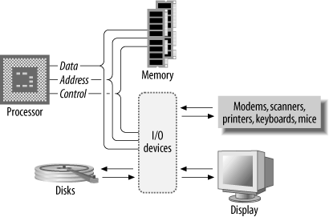
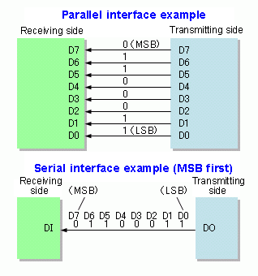

I/O=Alle Geräte die sich zusätzlich zu CPU/HS im Computer am gemeinsamen Bus befinden.

-   Massenspeicher: Festplatte, SSD (Solid State Disk)
-   Netzwerkkarten (Ethernet, WLAN, ...)
-   USB
    -   Maus / Tastatur / Externe Festplatte / USB Stick / Drucker / ...
-   Grafikkarte

Manche I/O Geräte (Controller) stellen einen weiteren Bus zur Verfügung

- USB
- Thunderbolt
- SATA (Festplatten)
- PCIe

## Seriell / Parallel

Daten können auf 2 Arten auf einem Bus übertragen werden.

- Parallel
- Seriell

 
[Quelle: wikipedia](https://de.wikipedia.org/wiki/Serielle_Datenübertragung)

Bei der **parallelen** Datenübertragung wird ein Byte auf einmal über 8 Leitungen übertragen (bzw. 16/32/64 Leitungen). 

Bei **serieller** Übertragung gibt es nur eine Datenleitung, die Bits werden zeitlich hintereinander in einer bestimmten Reihenfolge übertragen.

### Parallel

- Zur Anbindung der CPU an Speicher und I/O, Festplatten (SATA), Grafikkarten (PCIe)
- Hohe Geschwindigkeit
- Hoher Aufwand
- Nur für kurze Strecken (wenige cm)
  - Am oder nahe am Mainboard

### Seriell

- Wenige Leitungen (schlanke Kabel)
- Weitere Strecken (mehrere Meter)
- Einfache Stecker möglich
- Kostengünstig
- Geringer Stromverbrauch
- Praktisch jedes Netzwerk, jede Anbindung von Peripheriegeräten und Monitoren verwendet aktuell serielle Datenübertragung (USB, Thunderbolt, Ethernet, ...).

# Eigenschaften von I/O Geräten

-   Arbeiten autark, weitgehend ohne die Haupt-CPU zu belasten. Viele I/O Geräte haben dafür einen eigenen (kleinen) Prozessor.
-   Informieren die CPU per **Interrupt** wenn neue Daten da sind. Bsp. nach drücken einer Taste. Ein Interrupt unterbricht das aktuelle Programm in der CPU. 
    -   Die CPU wechselt in einen speziellen Programmcode für diesen Interrupt – ISR (Interrupt Service Routine)
    -   Die CPU holt sich (nach dem Interrupt) die Daten vom I/O Gerät
    -   Die CPU beendet den Interrupt und setzt das vorher unterbrochene Programm fort.
-   Teilweise können I/O Geräte die Daten auch gleich direkt in den Hauptspeicher schreiben, = **DMA** (direct memory access).

# Beispiel: Von einer Festplatte Daten lesen

-   Die CPU beauftragt den Festplatten-Controller Daten zu lesen und ab einer Speicheradresse im Hauptspeicher abzulegen.
-   Danach macht die CPU mit anderen Aufgaben weiter.
-   Der Festplatten-Controller wird aktiv und kopiert die Daten per DMA in den Hauptspeicher.
-   Der Festplatten-Controller informiert die CPU per Interrupt über das Ende des Vorgangs.
-   Die ISR in der CPU wird aktiv und bearbeitet die Daten, weiters wird dem Festplatten-Controller mitgeteilt, dass seine Aufgabe beendet ist.
-   Die CPU setzt das Programm das vor dem ISR aktiv war fort.

