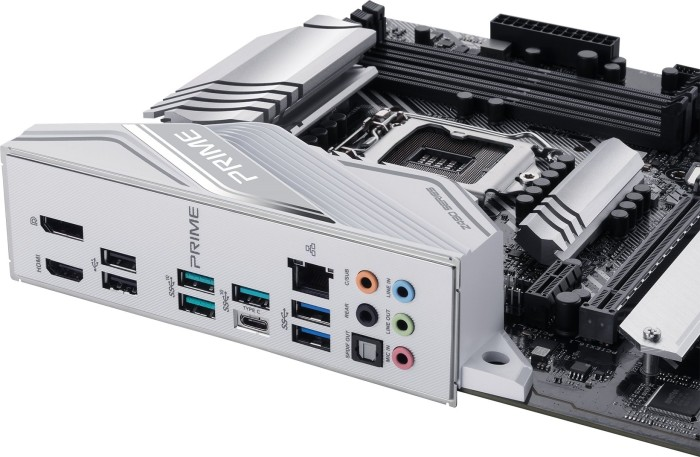
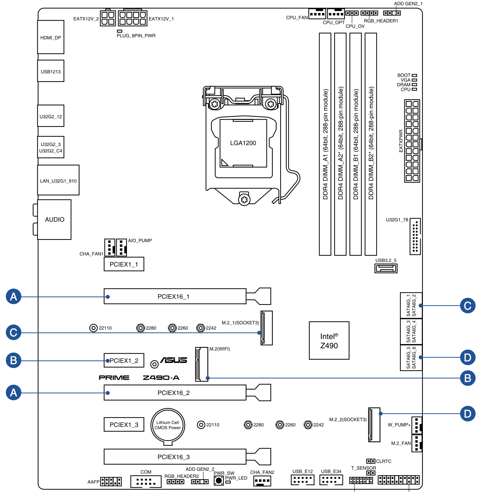
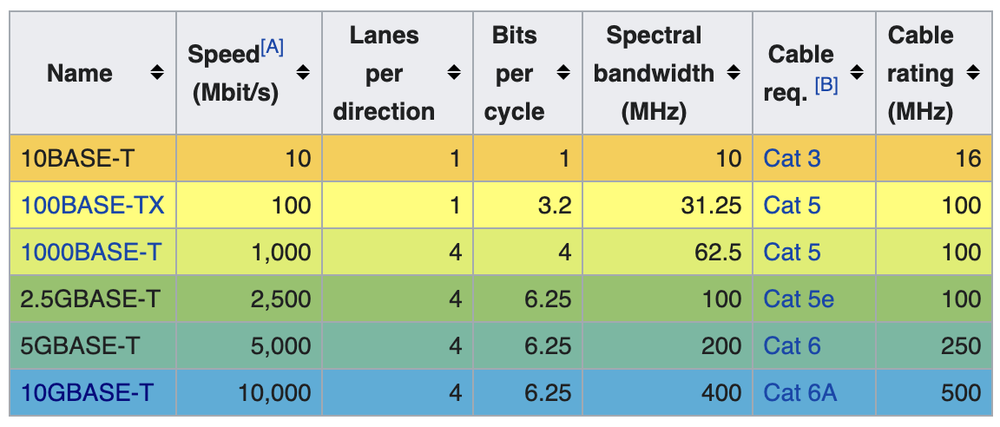

# IO BSysteme

Innerhalb eines PC's gibt es für I/O unterschiedliche Bus-Systeme. Geräte sind meist nicht fest verbunden sondern werden gesteckt, entweder direkt auf die Hauptplatine oder mit Hilfe von Kabeln. Manche I/O Geräte wie Festplatten werden innerhalb des Rechnergehäuses untergebracht und meist mechanisch fixiert. Andere wiederum werden mittels längerer Kabel (Tastatur) mit dem Rechner verbunden.

Innerhalb des Gehäuses :

-   PCIe
-   SATA

Außerhalb/Externe Kabel:

-   DisplayPort
-   USB
-   Ethernet LAN
-   Thunderbolt (=PCIe+DisplayPort+USB)

Außer PCIe sind alle **hot plugging** fähig, d.h. Geräte können im Betrieb hinzugefügt und entfernt werden.

Vergleich der Datenraten (ungefähre Best-Werte, bei aktueller HW)

-   PCIe (3.0, x4) 32 Gbit/s
-   Serial ATA (rev 3.0) 6 Gbit/s
-   DisplayPort (1.3) 32 Gbit/s
-   USB (2.0) 0,5 Gbit/s 
-   USB (3.0) 5 Gbit/s
-   Ethernet 1 Gbit/s
-   Thunderbolt (3) 40 Gbit/s

Beispiel Motherboard (ASUS Prime Z490-A, [geizhals](https://geizhals.at/asus-prime-z490-a-a2284654.html?hloc=at&hloc=de)):

Typische Anwendungen:

-   PCIe (Peripheral Component Interconnect Express ): Desktop Motherboard hat typischerweise 2-4 PCIe Steckplätze. Darauf gesteckt werden können Grafikkarten, Festplattenkontroller, Netzwerk-Interface-karten (NIC), etc.
-   Serial ATA (SATA): Typisch 6-8 auf Motherboard, für Festplatten.
-   DisplayPort (DP). Zum Anschluss von bis zu 3 4K Monitoren in daisy chain
-   USB (Universal Serial Bus) zum Anschluss diverser Peripheriekomponenten (Tastatur, Maus, Webcam, Mic, Lautsprecher, Externe Festplatten, USB Sticks, ...)
-   Ethernet, Netzwerk/LAN Anschluss
-   Thunderbolt: Universal-Anschluss, kombiniert DisplayPort (damit auch USB) und PCIe. Zusätzlich Netzteil Anschluss möglich (z.B. Laptop). Verwendet USB-C Stecker. Ziel: ein Anschluss für alles

## PCIe

[Video: Explaining PCIe Slots](https://youtu.be/PrXwe21biJo), [elektronik-kompendium.de](https://www.elektronik-kompendium.de/sites/com/0904051.htm)

-   Slots auf dem Motherboard in den die Karten gesteckt werden
-   Universalanschluss für alle Arten von Erweiterungskarten (inkl. Grafikkarten)
-   Daten werden in Lanes übertragen (bei aktuellem PCI 3.0 ca. 1GB/s pro Lane)
-   Mit jeder PCIe Version verdoppelt sich die Lane-Datenrate
-   Höhere Datenraten durch mehr Lanes (=längere Slots), 1x, 2x, 4x, 8x, 16x
-   In längere Slots (z.B. 16x) können kürzere Karten (z.B. 1x) gesteckt werden
-   Wenn mechanisch möglich sind längere Karten in kürzeren Slots auch OK

## SATA

Serial AT Attachment

[Video: SATA 3 - SERIAL ATA | WAS IST SATA III (3) ? COMPUTER BASICS DEUTSCH HD](https://youtu.be/T-6z8tCcR38), [wikipedia](https://en.wikipedia.org/wiki/Serial_ATA)

Zum Anschluss von Massenspeichern: Festplatten, SSD's, DVD Laufwerke

AT: von 1984 IBM AT wurde de facto Industriestandard. "Advanced Technology"

Aktuell: SATA revision 3.0 (6 Gbit/s, 600 MB/s, Serial ATA-600)

hot plugging fähig

## SAS

Serial Attached SCSI. [wikipedia SAS](https://en.wikipedia.org/wiki/Serial_Attached_SCSI). Alternative zu SATA in Servern. [SAS vs SATA: What's the Difference?](https://store.hp.com/us/en/tech-takes/sas-vs-sata)

Aktuell: SAS-4 (22,5 Gbit/s)

SAS ist Performanter und ist technologisch fortschrittlicher als SATA. Ist aber viel teurer und wird daher nur im Server Bereich eingesetzt.

## DisplayPort

[HDMI, DisplayPort, DVI, VGA, Thunderbolt - Video Port Comparison](https://youtu.be/iFO3EiQbNJ8)

Historie der Grafikschnittstellen

- VGA (Video Graphics Array, 1986) – Analog
- DVI (Digital Visual Interface, 1999) – Digital (teilw. kompatible zu VGA)
- HDMI – (High Definition Multimedia Interface, 2002) – Digital Video+Audio
  - 2009 Erweiterung um 100Mbps Ethernet Kanal
  - 2017: 4K@120Hz, 8K@60Hz
  - Fernseher, Beamer
- DisplayPort (2006) – Video, Audio, USB
  - Multi Monitor, daisy chain
  - 2016: 8K@60Hz
  - Computer, Monitore
- Thunderbolt (2011) – DisplayPort + PCIe
  - Mini DisplayPort Connector (alt)
  - USB-C Connector

[Graphics display resolution](https://en.wikipedia.org/wiki/Graphics_display_resolution)

## USB

[wikipedia (en)](https://en.wikipedia.org/wiki/USB)

Zum Verbinden aller möglicher Arten von Peripherie Geräten.

90er: viele unterschiedliche Schnittstellen an einem PC, USB aus dem Bestreben der Vereinheitlichung entstanden (eine Schnittstelle für alles).

Universal Serial Bus (seit 1996)

Bisher 4 Versionen (aktuell USB 3)

- Geschwindigkeitssteigerungen
- Mehr Arten von Geräten können angeschlossen werden
- Spannungsversorgung über das Kabel
- USB3 Ports sind innen blau
- USB 4 ist im wesentlichen Thunderbolt 3

USB 3:

- USB 3.0 (2010) 5 Gbit/s (10x USB2)
  - Typ A Buchsen, sollen blau kodiert sein
- USB 3.1 (2013) 10 Gbit/s 
  - USB-C Buchsen ()
- USB 3.2 (2017) 20 Gbit/s (bei USB-C)

Spannungsversorgung:

USB kann in allen Versionen angeschlossene Geräte versorgen (5 Volt).

- USB1: 100mA (0,5W)
- USB2: 500mA (2,5W) – z.B. für externe Festplatten
- USB3: 900mA (4,5W)

Battery charging:

[THE BASICS OF USB BATTERY CHARGING](https://www.maximintegrated.com/en/design/technical-documents/tutorials/4/4803.html)

USB hat sich als Standard zum laden von Akkus entwicklet. Es gibt Ladegeräte mit USB Buchse die nur Spannungsversorgung liefert aber keine Daten.

mehr als 100mA liefert ein USB Port nur dann wenn das Gerät (per Datenkommunikation) das anfordert.

Die battery charging Erweiterung von USB ermöglicht die Versorgung mit bis zu 1,5A ohne dass dazu eine digitale Kommunikation notwendig wäre.

Power delivery (USB-PD)

[USB-PD - USB Power Delivery](https://www.elektronik-kompendium.de/sites/com/1809251.htm)

Erlaubt die Versorgung in beiden Richtungen, d.h. auch der Host (z.B. Laptop) kann geladen werden. Beim Typ-C Stecker sind bis zu 100 W möglich.

Im Kabel ist ein Chip integriert der den Strom begrenzen kann.

USB-C

[derStandard: USB-C: Der einheitliche Anschluss ist zum Albtraum für die Nutzer geworden](https://www.derstandard.at/story/2000120074369/usb-c-der-einheitliche-anschluss-ist-zum-albtraum-fuer-die)

## Ethernet LAN

Siehe Netzwerktechnik.

Quelle: [wikipedia](https://en.wikipedia.org/wiki/2.5GBASE-T_and_5GBASE-T)

[10GBASE-T](https://en.wikipedia.org/wiki/10_Gigabit_Ethernet#10GBASE-T)

[2.5GBASE-T_and_5GBASE-T)](https://en.wikipedia.org/wiki/2.5GBASE-T_and_5GBASE-T)

> The intermediate speeds became relevant around 2014 as it became clear that it would not be possible to run 10GBASE-T over the Cat5e cable that had been used for the wiring in many buildings but that, with the development of fast WiFi protocols such as IEEE 802.11ac, there was a significant demand for cheap uplink faster than 1000BASE-T offered. IEEE 802.3bz will also support Power over Ethernet, which has generally not been available at 10GBASE-T.

## Thunderbolt

Thunderbolt-3, USB-C Stecker. 

Achtung: USB-C bezeichnet nur einen Stecker-Typ.

> Thunderbolt combines [PCI Express](https://en.wikipedia.org/wiki/PCI_Express) (PCIe) and [DisplayPort](https://en.wikipedia.org/wiki/DisplayPort) (DP) into two [serial](https://en.wikipedia.org/wiki/Serial_communication) signals,[[5\]](https://en.wikipedia.org/wiki/Thunderbolt_(interface)#cite_note-5)[[6\]](https://en.wikipedia.org/wiki/Thunderbolt_(interface)#cite_note-cunningham2015-6) and additionally provides [DC power](https://en.wikipedia.org/wiki/Direct_current), all in one cable.

40 Gbit/s (5 GB/s), allowing PCIe 3.0, DisplayPort 1.2, and USB 3.1 10 Gbit/s.

Using USB-C on copper cables, it can incorporate USB Power Delivery, allowing the ports to source or sink up to 100 watts of power.

## Kompatibilität

Eine der grundlegenden Designprinzipien der Computerarchitektur ist die **Modularität**, d.h. das man unterschiedliche Komponenten  miteinander verbinden kann. Wenn man als Anwender davon ausgehen kann, dass das grundsätzlich funktioniert auch bei unterschiedlichen Herstellern und Alter der Komponenten spricht man von **Kompatibilität**. Kompatibilität wird erreicht indem sich Hersteller an gemeinsame Standards halten und diese Standards (z.B. USB) selbst eine größtmögliche Kompatibilität gewährleisten (was meist mit relativ viel Aufwand verbunden ist).

Man kann unterschiedliche Arten von Kompatibilität unterscheiden:

-   **Herstellerübergreifende Kompatibilität**. Produkte unterschiedlicher Hersteller für den gleichen Zweck sind austauschbar. Z.B. kann man Grafikkarten unterschiedlicher Hersteller am gleichen PC Motherboard betreiben, oder man kann die Maus gegen eine andere Tauschen.
-   **Abwärtskompatibilität**. Wenn alte Geräte auch an einem neuen System funktionieren. Z.B. USB1 Geräte sind auf USB2 und auch USB3 Schnittstellen noch verwendbar. In Software ist dies z.B. dann gewährleistet wenn eine neue Version eines Programms auch noch die Dateien einer alten Version lesen kann.
    Diese Art der Kompatibilität ist vielfach gewährleistet kann aber zu Funktions bzw. Performance Verlusten führen.
-   **Aufwärtskompatibilität**. Wenn neue Geräte auch an einem alten System betrieben werden können. Durchaus auch gängige Art der Kompatibilität bei neueren HW Systemen. Beispiel: Eine PCIe 3.0 Grafikkarte kann in einem PCIe 2.0 Steckplatz betrieben werden. Aufwärtskompatibilität in Software ist eher schwierig zu erreichen, denn das würde z.B. bedeuten dass eine Datei die von einem V2.0 Softwarestand erzeugt wurde auch noch vom V1.0 Stand gelesen werden könnte.

